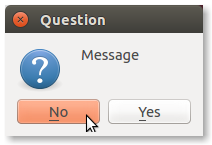

# Python チュートリアル - その2

## Python プログラミング

### 比較と真偽値

IPython 上で数値を比較してみます．<br>
ロボットでは状態を数値で見て基準値や制限値などとの比較をしたりします．

比較が正しければ `True` を正しくなければ `False` の真偽値（ブーリアン）を返してきます．

```python
In [21]: c = 40
In [22]: d = 50
In [23]: c < d
Out[23]: True
In [24]: c > d
Out[24]: False
In [25]: c == d
Out[25]: False
In [26]: c != d
Out[26]: True
```

```python
In [27]: e = c < d
In [28]: f = d > d
In [29]: g = c == d
In [30]: h = c != d
In [31]: print( e, f, g, h )
(True, False, False, True)
```

`g = c == d` は少しややこしいですが
`=` と `==` の違いを知ってしまえば何のことはありません．<br>
`=` は「代入」でした．「代入演算子」と呼ばれています．<br>
`==` は「比較」をしています．「比較演算子」の「等しい」です．<br>
つまり `c == d` の比較結果 `True` もしくは `False` を `g` に代入しているわけです．

`!=` は比較演算子の1つで「等しくない」を意味します．<br>
`c != d` では `c` と `d` が
この場合 `40` と `50` で「等しくない」が「正しい」ので `True` が返ってきます．


### 関数

プログラムで非常に便利なのが「関数」です．
関数は何か値を渡すと決まった処理をした値を返してくるものです．

Python に限らずプログラミングにおける関数の最も大きな利点に次の2つが挙げられます．

- 同じ処理を何度もプログラム上に記述しなくて済む（関数を呼び出すだけで済む）
- 各処理機能をそれぞれのまとまりにするのでプログラムが読みやすくなる

簡単な関数を定義してみます．
ここでは数学の関数 *y = x<sup>2</sup>* を Python の関数で定義します．

```python
In [71]: def square_number(x):    # Ctrl + Enter
    ...:     return x ** 2        # Ctrl + Enter
    ...:                          # Enter
```

`def square_number(x):` と入力してから `Ctrl` キーを押しながら `Enter` を押します．<br>
`Ctrl` + `Enter` キーでプログラムを実行せずに改行がされます．<br>
次に `    return x ** 2` と入力して `Ctrl` + `Enter` します．
そして `Enter` を押して関数の定義は終了です．

- **注意** : Python ではインデントでプログラムのまとまり（**ブロック**）を表現します．
本例では `return x ** 2` が `def square_number(x):` の中身になるので
`return x ** 2` のインデントを1つ下げています．
関数の中だけではなく後ほど出てくる条件文でもインデントを用いたブロックで内外を区別します．

ここで定義した関数の内容をまとめると次のようになります．

- 関数名 : `square_number`
- 引数　 : `x` （入力値を入れる変数）
- 戻り値 : `x ** 2` （`x`の2乗）

それでは定義した関数を使ってみます．

```python
In [72]: y = square_number(2)
In [73]: print(y)
4

In [74]: z = square_number(5)
In [75]: print(z)
25
```

関数 `square_number()` に与えた値の2乗の値が返ってっくることと思います．

まず例として数値の処理を関数で定義してみましたが
関数ができることは数値の処理だけではありません．
文字列の操作などプログラムで書ける処理であれば何でもできます．

```python
In [81]: def print_words( p, q ):
    ...:     r = p + ' ' + q
    ...:     print(r)
    ...:     return
    ...:

In [82]: a = "robot"
In [83]: b = "programmer"

In [84]: print_words( a, b )
robot programmer

In [85]: print_words( b, a )
programmer robot
```

- **注意** : 入力時に `def print_words( p, q ):` 内のインデントが揃うように気をつけてください．


### クラス

ここまでの Python チュートリアルで
プログラム命令を使って数値や文字列，変数，リスト，関数の操作を行いました．
それらの変数や関数をまとめて1つの機能のまとまりにしたのが「クラス」です．

Python や ROS のライブラリの多くは「クラス」の形式で提供されています．

Python におけるクラスの基本的な構造は次のような構成になっています．

```python
class MyClass:

    def __init__( self, x = 3.0, y = 2.0, name = 'Name' ):
        self.x = x
        self.y = y
        self.name = name

    def function( self ):
        return self.x + self.y

    def print_result( self ):
        print( '%8s - x: %5.2f  y: %5.2f  => Result: %5.2f'
              % ( self.name, self.x, self.y, self.function() ) )
```

クラス内で定義された関数はそのクラスの「メソッド」と呼びます．
また `__init__()` はクラスの初期化を行っている「コンストラクタ」です．

クラスを利用する側では次のようにクラスを「インスタンス」化して使用します．

```python
    a = MyClass()
    b = MyClass( 5.0, 4.0, 'B' )

    a.print_result()

    a.x = 6.0
    a.y = 7.0
    a.name = 'A'
    a.print_result()

    b.print_result()
```

上記の例では `a` や `b` が「`MyClass` クラスのインスタンス」と呼ばれます．

IPython で実行すると次のようになります．

- **注意** : 入力時にインデントに気をつけてください．

```python
In [1]: class MyClass:
   ...:     def __init__( self, x = 3.0, y = 2.0, name = 'Name' ):
   ...:         self.x = x
   ...:         self.y = y
   ...:         self.name = name
   ...:     def function( self ):
   ...:         return self.x + self.y
   ...:     def print_result( self ):
   ...:         print( '%8s - x: %5.2f  y: %5.2f  => Result: %5.2f'
   ...:               % ( self.name, self.x, self.y, self.function() ) )
   ...:         

In [2]: a = MyClass()
In [3]: b = MyClass( 5.0, 4.0, 'B' )

In [4]: a.print_result()
    Name - x:  3.00  y:  2.00  => Result:  5.00

In [5]: a.x = 6.0
In [6]: a.y = 7.0
In [7]: a.name = 'A'
In [8]: a.print_result()
       A - x:  6.00  y:  7.00  => Result: 13.00

In [9]: b.print_result()
       B - x:  5.00  y:  4.00  => Result:  9.00
```

-----

＜参考＞ 同じことを Python プログラムファイルに書くと次のようになります．

**pyclass_example.py**
```python
#!/usr/bin/env python

class MyClass:

    def __init__( self, x = 3.0, y = 2.0, name = 'Name' ):
        self.x = x
        self.y = y
        self.name = name

    def function( self ):
        return self.x + self.y

    def print_result( self ):
        print( '%8s - x: %5.2f  y: %5.2f  => Result: %5.2f'
              % ( self.name, self.x, self.y, self.function() ) )


def main():

    a = MyClass()
    b = MyClass( 5.0, 4.0, 'B' )

    a.print_result()

    a.x = 6.0
    a.y = 7.0
    a.name = 'A'
    a.print_result()

    b.print_result()


if __name__ == '__main__':

    main()

```

Python プログラム（Pythonスクリプト）ファイルの実行方法には次の方法があります．
いずれもターミナルから入力して実行します．

- `python` に続けてファイル名を入力
```
$ python pyclass_example.py
```
- Python スクリプトファイルに実行権限を付与（後の章で詳述）して `./ファイル名` で実行
```
$ ./pyclass_example.py
```

pyclass_example.py の実行結果です．

```
$ python pyclass_example.py
    Name - x:  3.00  y:  2.00  => Result:  5.00
       A - x:  6.00  y:  7.00  => Result: 13.00
       B - x:  5.00  y:  4.00  => Result:  9.00
```


### 制御フローツール

#### while 文

条件判断により繰り返し実行に使われるのが while 文です．
while 文の基本的な構造は次のようになっています．

```python
while 条件:
    処理
```

`条件` が `True` である限り `処理` を繰り返します．

次の例では `i` が `10` 未満である限り `while` の中を繰り返します．
`while` の中では1回実行される毎に `i` に `1` ずつ足され `i` が `10` になると
次の `while` の条件判断で `i < 10` が `False` になるので
ループを抜けます．

**py_while.py**

```python
#!/usr/bin/env python

i = 0
while i < 10:
    print( i )
    i += 1

print( "while loop ended at i=%d" % i )
```

py_while.py の実行結果

```
$ python py_while.py
0
1
2
3
4
5
6
7
8
9
while loop ended at i=10
```

#### if 文

条件分岐などに使われるのが if 文です．
if 文の基本的な構造は次のようになっています．

```python
if 条件1:
    処理1
elif 条件2:
    処理2
else:
    処理3
```

もし `条件1` が `True` なら `処理1` を実行し <br>
`条件1` が `False` で `条件2` が `True` なら `処理2` を実行し <br>
`条件1`，`条件2` ともに `False` であれば `処理3` が実行されます．

次の例では [ No ] [ Yes ] の選択をするウィンドウを表示します．



[ Yes ] ボタンが押された場合は `if` 内の条件評価が `True` になるので
関数 `qestion_yn()` が `True` を返します．
それ以外は `else` 内の処理が実行されて `qestion_yn()` が `False` を返します．

**pyqt_question.py**

```python
#!/usr/bin/env python

import sys
from PyQt4 import QtGui

def question_yn( qmsg='Message', title='Question' ):

    msgbox = QtGui.QMessageBox()
    result = msgbox.question( msgbox, title, qmsg, msgbox.Yes | msgbox.No, msgbox.No )

    if result == msgbox.Yes:
        return True
    else:
        return False


if __name__ == '__main__':

    app = QtGui.QApplication(sys.argv)    

    print( question_yn() )
    print( question_yn("No/Yes") )
    print( question_yn("Question", "ROS Question") )

```

pyqt_quesiton.py の実行結果例（ Yes / No の選択による ）

```
$ python pyqt_question.py
False
True
False
```


#### for 文

特定の回数の繰り返し実行に用いられるのが for 文です．
Python の for 文はリストまたは文字列の任意のシーケンス型にわたって反復処理を行います．

```python
for 要素 in シーケンス型:
    処理
```

`シーケンス型` の各 `要素` について `処理` を行います．

**py_for.py**

```python
#!/usr/bin/env python

num_list = [ 10.0, 20.0, 30.0, 40.0, 50.0 ]

for x in num_list:
    print( x )

for i in range(5):
    print( i )

for n in range( len(num_list) ):
    print( "{0:2d} : {1:5.1f}".format(n, num_list[n]) )
```

py_for.py の実行結果

```
$ ./py_for.py
10.0
20.0
30.0
40.0
50.0
0
1
2
3
4
 0 : 10.00
 1 : 20.00
 2 : 30.00
 3 : 40.00
 4 : 50.00
```


### コメント文

プログラミング言語一般にコメントアウト部分は実行が行われません．
実行されないものをプログラムに書く理由はいくつかあります．

- 命令文やクラス，関数，変数などの説明
- 変更や修正などのときに既存の文をコメントとして仮に残す
- ...

他の人がプログラムを見ても分かる，
また後々に自分がプログラムを見返すときも分かるように説明文を入れます．


#### 1行のコメントアウト

Python で1行だけコメントアウトする場合は `#` を書けば
`#` 以降，行末までがコメント文となります．

```python
# 行全体のコメント
print( "Comment Test" )    # 行の途中から行末までのコメント
# print( "Done" )
```

実行結果

```
Comment Test
```


#### 複数行のコメントアウト

Python で複数行コメントアウトする場合は
3つのシングルクォーテーション `'''` もしくは
3つのダブルクォーテーション `"""` で囲みます．
ただし，周りのインデントと揃える必要があります．

```python
for i in range(5):
    '''
    複数行のコメント文
    print( "Comment Test" ) を試します．この行はコメント内で実行されません．
    '''
    print( "Comment Test" )
```

実行結果

```
Comment Test
Comment Test
Comment Test
Comment Test
Comment Test
```


<!-- EOF -->
