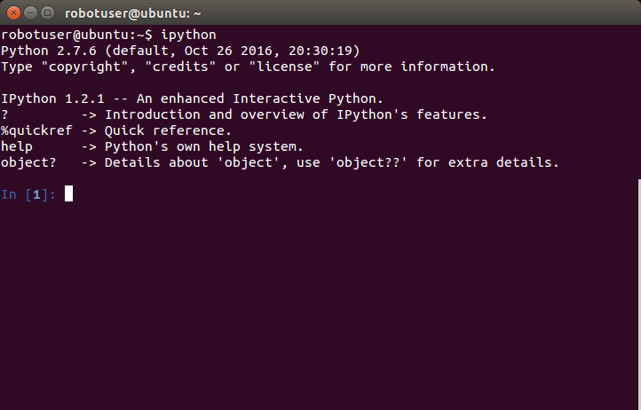
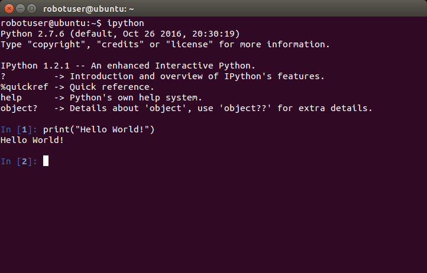

# Python チュートリアル - その1

## Python とは

本チュートリアルではロボットの操作にプログラミング言語 Python を使用しています．
Python はロボットに限らず広く利用されているコンピュータプログラミング言語です．

Python はプログラムの文を書いたらすぐに実行できるので非常に便利です．
プログラムを書いては実行して試して修正して...を頻繁に繰り返せるので
プログラミングの習得に適していますし，
ソフトウェア開発作業でも不具合修正に非常に適しています．


## Python をはじめる

Python プログラムの実行には次の2通りの方法があります．

- Python コンソールを使って1行から数行のプログラムを入力・実行
- プログラム文を書いたテキストファイルを保存してそれを実行

本章では Python コーンソールを使ってプログラムを1行ずつ入力・実行することで，
Python がどのように実行されるのかを見てみます．


### IPython の起動

Python コンソールとして IPython を使います．
ターミナル上 `ipython` （全て小文字）と入力して `Enter` キーを押すと
IPython コンソールが起動します．



- メモ : IPython がインストールされていない場合はインストールしてください．
  - 方法-1
    ```
    $ pip install ipython
    ```
  - 方法-2
    ```
    $ sudo apt-get update
    $ sudo apt-get dist-upgrade
    $ suoo apt-get install ipython
    ```
    - 注意: 方法-2 には Ubuntu PC の管理者パスワードが必要


### 命令文の入力と実行

IPython コンソールに次の行の `print` 以降を入力して `Enter` キーを押します．

```python
In [1]: print("Hello World!")
```



```python
In [1]: print("Hello World!")
Hello World!

In [2]:
```

`Hello World!` と出力されたと思います．


### 計算

Python で数の計算をしてみます．`1 + 1` と入力して `Enter` キーを押します．

```python
In [2]: 1 + 1
Out[2]: 2
```

掛け算です．

```python
In [3]: 2 * 3
Out[3]: 6
```

割り算です．
Python 3.x での結果です．

```python
In [4]: 3 / 2
Out[4]: 1.5
```

Python 2.x では整数の割り算の結果が Python 3.x とは異なります．

```python
In [4]: 3 / 2
Out[4]: 1
```

Python 2.x では整数の割り算は `3 / 2` 答えが `1` （余りが `1` ）と出力されます．<br>
Python 2.x で小数点以下も記述して再び計算してみます．

```python
In [5]: 3.0 / 2.0
Out[5]: 1.5
```

Python 2.x の計算では整数（整数型）を扱っているのか，
小数点を含んだ数（浮動小数点型）を扱っているのか
を意識する必要があります．


### 変数

次はプログラムらしく「変数」を使って計算してみます．
変数へ値を入れるのに `=` を使って「代入」します．

```python
In [6]: a = 4
In [7]: b = 5
In [8]: a * b
Out[8]: 20
```

```python
In [9]: x = 4.0
In [10]: y = 5.0
In [11]: z = x * y
In [12]: print(z)
20.0
```


### リスト

変数は1つの値しか扱いませんが多くの数値をまとまって扱いたい場合に利用するものに
「リスト」や「マトリクス」などがあります．

リストは `[ ]` で定義します．
注意が必要なのはリストの1つ目の入れ物の番号（インデックス）が
`1` ではなく `0` であることです．

```python
In [41]: list = [ 10, 20, 30, 40, 50 ]
In [42]: list[0]
Out[42]: 10
In [43]: list[1]
Out[43]: 20
In [44]: list[2]
Out[44]: 30
In [45]: list[5]
---------------------------------------------------------------------------
IndexError                                Traceback (most recent call last)
<ipython-input-5-48bc095b4faf> in <module>()
----> 1 list[5]
IndexError: list index out of range
In [46]: list[4]
Out[46]: 50
In [47]: list[-1]
Out[47]: 50
In [48]: print(list)
[10, 20, 30, 40, 50]
```

上記のリストの例では `list` に5つ値のあるリストを定義しました．
インデックスが `0` から始まるので5つ目のインデックスは `4` になります．
インデックス `5` の入れ物はこのリストには存在しないので `list[5]` を実行すると
`IndexError` が返ってきます．
この例の場合は最後に格納されている値を読むには `list[4]` または `list[-1]` とすれば
値 `50` を読むことができます．

リストのリストがマトリクスになります．

```python
In [51]: matrix = [ [ 1, 2, 3, 4, 5 ], [ 6, 7, 8, 9, 10 ], [ 11, 12, 13, 14, 15] ]
In [52]: matrix[0]
Out[52]: [1, 2, 3, 4, 5]
In [53]: matrix[1]
Out[53]: [6, 7, 8, 9, 10]
In [54]: matrix[2]
Out[54]: [11, 12, 13, 14, 15]
```


### 文字列

文字列も少し扱ってみます．

```python
In [61]: p = 'robot '
In [62]: q = 'programmer'
In [63]: print(p)
robot
In [64]: print(q)
programmer
In [65]: r = p + q
In [66]: print(r)
robot programmer
In [67]: r = p * 3 + q
In [68]: print(r)
robot robot robot programmer
```


<!-- EOF -->
