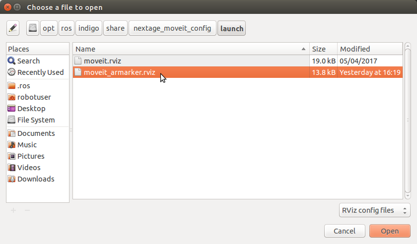

# 発展的なロボットプログラミング

本章は NEXTAGE OPEN ロボットシミュレータを対象にしてチュートリアルを進めてゆきます．

NEXTAGE OPEN の下記ソフトウェアを既に起動した状態で
本章の各プログラムを実行してください．

- NEXTAGE OPEN の Gazebo シミュレータもしくは hypsys(RTM) シミュレータ
- NEXTAGE OPEN の MoveIt!


## プログラム制御フローツールとロボットプログラミング

プログラムの制御フローツールを用いることで，
より簡潔なプログラムやより複雑なロボット動作プログラムを作成することができます．


### 条件判断とロボット動作 - if

条件判断を行う `if` 文とロボット動作計画を組み合わせて使ってみます．

下のプログラム例では
動作の実行の可否を問うウィンドウを開いて [ Yes ] ボタンがクリックされた場合に
`True` を返す関数 `question_yn()` を利用しています．

本文中の `if` 文の条件部分で関数 `question_yn()` を呼び出して
返ってきた `True`/`False` により「動作の実行」と「スキップ」の分岐を行っています．

```
$ rosrun tork_moveit_tutorial nextage_moveit_tutorial_poses_ifqyn.py
```

**nextage_moveit_tutorial_poses_ifqyn.py**
```python
#!/usr/bin/env python

import sys, copy
import rospy

from moveit_commander import MoveGroupCommander
from geometry_msgs.msg import Pose

from tork_moveit_tutorial import init_node, question_yn


if __name__ == '__main__':

    init_node()
    group = MoveGroupCommander("right_arm")

    # Pose Target 1
    rospy.loginfo( "Start Pose Target 1")
    pose_target_1 = Pose()

    pose_target_1.position.x = 0.4
    pose_target_1.position.y = -0.4
    pose_target_1.position.z = 0.15
    pose_target_1.orientation.x = 0.0
    pose_target_1.orientation.y = -0.707
    pose_target_1.orientation.z = 0.0
    pose_target_1.orientation.w = 0.707

    rospy.loginfo( "Set Target to Pose:\n{}".format( pose_target_1 ) )
    group.set_pose_target( pose_target_1 )

    if question_yn( "Start moving to target 1 ?" ):
        group.go()

    # Pose Target 2
    rospy.loginfo( "Start Pose Target 2")
    pose_target_2 = Pose()

    pose_target_2.position.x = 0.3
    pose_target_2.position.y = -0.3
    pose_target_2.position.z = 0.5
    pose_target_2.orientation.y = -1.0

    rospy.loginfo( "Set Target to Pose:\n{}".format( pose_target_2 ) )
    group.set_pose_target( pose_target_2 )

    if question_yn( "Start moving to target 2 ?" ):
        group.go()

```


### 繰り返しとロボット動作 - for

指定回数繰り返しを行う `for` 文とロボット動作計画を組み合わせて使ってみます．

下のプログラム例では
`for` 文で動作計画と実行を5回繰り返し，
繰り返すごとに右腕の目標姿勢のY座標を `step` 変数で指定した長さ横に移動します．

```
$ rosrun tork_moveit_tutorial nextage_moveit_tutorial_poses_for.py
```

**nextage_moveit_tutorial_poses_for.py**

```python
#!/usr/bin/env python

import sys, copy
import rospy

from moveit_commander import MoveGroupCommander
from geometry_msgs.msg import Pose

from tork_moveit_tutorial import init_node, question_yn


if __name__ == '__main__':

    init_node()
    group = MoveGroupCommander("right_arm")

    # Pose Target 1
    rospy.loginfo( "Start Pose Target 1")
    pose_target_1 = Pose()

    pose_target_1.position.x = 0.3
    pose_target_1.position.y = 0.0
    pose_target_1.position.z = 0.2
    pose_target_1.orientation.x = 0.0
    pose_target_1.orientation.y = -0.707
    pose_target_1.orientation.z = 0.0
    pose_target_1.orientation.w = 0.707

    step = -0.1

    for i in range(5):
        pose_target_1.position.y = i * step
        rospy.loginfo( "Set Target to Pose No.{}:\n{}".format( i, pose_target_1 ) )

        group.set_pose_target( pose_target_1 )

        if question_yn( "Start moving to target No.{} ?".format( i ) ):
            group.go()
        else:
            rospy.loginfo( "Skipped Pose No.{}".format( i ) )

```


## プログラムのタイミングを図る

### プログラムの一時休止 - sleep

プログラムの一時休止には `rospy.sleep(duration)` を使います．

`rospy.sleep()` には
浮動小数点型の数値（単位:秒）か `Duration` 型を渡します．
渡した時間の長さだけプログラムを休止させます．

`rospy.sleep()` の基本的な記法を下に示します．

```python
# sleep for 10 seconds
rospy.sleep(10.)

# sleep for duration
d = rospy.Duration(10, 0)
rospy.sleep(d)
```

`Duration( secs, nsecs )` に渡す数値は各々下のようになっています．

- secs  : 秒（整数 / デフォルト=`0` ）
- nsecs : ナノ秒（整数 / デフォルト=`0` ）


### プログラムループの一定時間間隔実行 - Rate

プログラムのループを一定時間間隔で実行するには `rospy.Rate(hz)` を使います．

`rospy.Rate(hz)` には周波数（単位:Hz）を浮動小数点型で渡します．

使用方法は `rospy.Rate(hz)` を周波数を設定して
プログラムループ内で `Rate.sleep()` を行うと次の周期までプログラムを停止します．

`rospy.Rate()` の基本的な記法を下に示します．

```python
r = rospy.Rate(10) # 10hz
while not rospy.is_shutdown():
    print( "Hello 10Hz" )
    r.sleep()
```

- 参考 : ROS Wiki - Sleeping and Rates
  - [http://wiki.ros.org/rospy/Overview/Time#Sleeping_and_Rates][1450a59e]

  [1450a59e]: http://wiki.ros.org/rospy/Overview/Time#Sleeping_and_Rates "ROS Wiki - Sleeping and Rates"


### 関数の定期呼び出し - Timer

プログラムの関数を一定時間間隔で呼び出して実行するには
`rospy.Timer()` を用いることができます．

- rospy.Timer(period, callback, oneshot=False)
  - period
    - 呼び出し間隔
    - `Duration` 型
  - callback
    - 呼び出される関数
  - oneshot
    - 1回だけの実行か
    - `True` / `False`
    - デフォルト : `False`（1回だけの実行ではない）

下記の例では関数 `my_callback()` を2秒ごとに呼び出しています．

```python
def my_callback(event):
    print( 'Timer called at {}'.format( event.current_real ) )

rospy.Timer( rospy.Duration(2), my_callback )
```

- 参考 : ROS Wiki - Timer
  - [http://wiki.ros.org/rospy/Overview/Time#Timer][9a46e9d1]

  [9a46e9d1]: http://wiki.ros.org/rospy/Overview/Time#Timer "ROS Wiki - Timer"


### ROSノードを停止させずに待機 - spin

`Timer` などで呼び出し関数を設定しても
そのプログラム（ROSノード）が終了してしまっては関数も呼び出されないので
待機状態にする必要があります．

ROSノードを終了させずにそこで待機状態にするのが `rospy.spin()` です．

`rospy.spin()` の記法を下に示します．

```python
rospy.spin()
```


### 定期的に動くロボットプログラム例

`rospy.Rate()` を使ってロボットが動作を実行する時間の間隔を指定します．

下記プログラムでは次のことを行っています．

- `pose_target_1` にロボット右腕の初期姿勢を定義
- ログメッセージを表示してから `rospy.sleep(5.0)` で5秒休止
- `rate = rospy.Rate(0.2)` で 0.2 [Hz] つまり5秒に1回の時間間隔を設定
- `while not rospy.is_shutdown():` ノードが終了指定ない限り次のループを反復
  - `group.set_pose_target( pose_target_1 )` で目標姿勢を設定
  - `group.go()` で動作計画・実行
  - 目標姿勢の位置のY座標を `step` だけずらす
  - 目標姿勢の位置のY座標が -0.4 [m] よりも小さくなったら 0.0 [m] を代入
  - `rate.sleep()` で次のタイミングが来るまで休止

```
$ rosrun tork_moveit_tutorial nextage_moveit_tutorial_poses_rate.py
```

**nextage_moveit_tutorial_poses_rate.py**

```python
#!/usr/bin/env python

import sys, copy
import rospy

from moveit_commander import MoveGroupCommander
from geometry_msgs.msg import Pose

from tork_moveit_tutorial import init_node


if __name__ == '__main__':

    init_node()
    group = MoveGroupCommander("right_arm")

    # Pose Target 1
    pose_target_1 = Pose()

    pose_target_1.position.x = 0.3
    pose_target_1.position.y = 0.0
    pose_target_1.position.z = 0.2
    pose_target_1.orientation.x = 0.0
    pose_target_1.orientation.y = -0.707
    pose_target_1.orientation.z = 0.0
    pose_target_1.orientation.w = 0.707

    rospy.loginfo( "Start Move Loop / Ctrl-C to Stop \nWaiting 5 seconds" )
    rospy.sleep(5.0)

    step = -0.1

    rate = rospy.Rate(0.2)
    while not rospy.is_shutdown():

        rospy.loginfo( "Set Target to Pose:\n{}".format( pose_target_1 ) )
        group.set_pose_target( pose_target_1 )
        group.plan()
        group.go()

        pose_target_1.position.y += step
        if pose_target_1.position.y < -0.4:
            pose_target_1.position.y = 0.0

        rospy.loginfo( "Waiting Next... / Ctrl-C to Stop" )
        rate.sleep()

```


## より複雑なロボット動作計画

### 動作アームを指定する

<$ifeq <$ROS_DISTRO>|indigo>

これまで NEXTAGE OPEN や Baxter Research Robot の動作プログラムの例では
「右腕」を動かしていました．
これらのロボットは双腕ですから「右腕」だけでなく「左腕」や「両腕」を動かすこともできます．

<$endif>

<$ifneq <$ROS_DISTRO>|indigo>

これまで NEXTAGE OPEN や duaro の動作プログラムの例では
NEXTAGE OPEN では「右腕」( right_arm ) を，
duaro では「上側の腕」(upper_arm) を動かしていました．
これらのロボットは双腕ですから「右腕」や「上側の腕」だけでなく
「左腕」や「下側の腕」，「両腕」を動かすこともできます．

<$endif>

<$ifeq <$ROS_DISTRO>|indigo>

#### 左腕を動かす

「左腕」を動かすには次の変更を行います．

- 動作グループを `left_arm` に変更（ NEXTAGE OPEN / Baxter Research Robot 共通）
```python
group = MoveGroupCommander("right_arm")    # 変更前（右腕）
↓
group = MoveGroupCommander("left_arm")     # 変更後（左腕）
```

<$endif>

<$ifneq <$ROS_DISTRO>|indigo>

#### もう一方の腕を動かす

NEXTAGE OPEN の「左腕」を動かすには次の変更を行います．

- 動作グループを `left_arm` に変更
```python
group = MoveGroupCommander("right_arm")    # 変更前（右腕）
↓
group = MoveGroupCommander("left_arm")     # 変更後（左腕）
```

KHI duaro の「下側の腕」を動かすには次の変更を行います．

- 動作グループを `lower_arm` に変更
```python
group = MoveGroupCommander("upper_arm")    # 変更前（上側の腕）
↓
group = MoveGroupCommander("lower_arm")    # 変更後（下側の腕）
```

<$endif>

下記プログラムは NEXTAGE OPEN の左腕を動かすプログラムの例です．
右腕のターゲット姿勢のままでは左腕の動作にはきつくなるので
ターゲット位置のY座標の正負（左右）を反転しています．

```
$ rosrun tork_moveit_tutorial nextage_moveit_tutorial_poses_left_arm.py
```

**nextage_moveit_tutorial_poses_left_arm.py**

```python
#!/usr/bin/env python

import sys, copy
import rospy

from moveit_commander import MoveGroupCommander
from geometry_msgs.msg import Pose

from tork_moveit_tutorial import init_node, question_yn


if __name__ == '__main__':

    init_node()

    group = MoveGroupCommander("left_arm")

    # Pose Target 1
    rospy.loginfo( "Start Pose Target 1")
    pose_target_1 = Pose()

    pose_target_1.position.x = 0.4
    pose_target_1.position.y = 0.4
    pose_target_1.position.z = 0.15
    pose_target_1.orientation.x = 0.0
    pose_target_1.orientation.y = -0.707
    pose_target_1.orientation.z = 0.0
    pose_target_1.orientation.w = 0.707

    rospy.loginfo( "Set Target to Pose:\n{}".format( pose_target_1 ) )
    group.set_pose_target( pose_target_1 )
    group.go()

    # Pose Target 2
    rospy.loginfo( "Start Pose Target 2")
    pose_target_2 = Pose()

    pose_target_2.position.x = 0.3
    pose_target_2.position.y = 0.3
    pose_target_2.position.z = 0.5
    pose_target_2.orientation.y = -1.0

    rospy.loginfo( "Set Target to Pose:\n{}".format( pose_target_2 ) )
    group.set_pose_target( pose_target_2 )
    group.go()

```


#### 両腕を動かす

前項目で動作グループに `left_arm` を指定して左腕を動かしました．
他に指定できる「動作グループ」に何があるのかは動作プログラムの例を実行したときに
表示されるようにしてあります．

下の出力例は NEXTAGE OPEN の場合のもので `right_arm` や `left_arm` の他に
`botharms` や `head` , `torso` などがあるのが分かります．

```
$ rosrun tork_moveit_tutorial nextage_moveit_tutorial_poses_left_arm.py
[ INFO] [1511612715.981903861]: Loading robot model 'NextageOpen'...
[INFO] [WallTime: 1511612716.988247] [0.000000] Move Groups defined in the robot :
botharms
head
left_arm
left_arm_torso
left_hand
right_arm
right_arm_torso
right_hand
torso
upperbody
[ INFO] [1511612718.120724861, 43.933000000]: TrajectoryExecution will use new action capability.
[ INFO] [1511612718.120966861, 43.933000000]: Ready to take MoveGroup commands for group left_arm.
```

双腕のロボットで「両腕」を動かすには「両腕のグループ」を使います．
上記の出力結果から NEXTAGE OPEN では `botharms` の動作グループがあります．

<$ifeq <$ROS_DISTRO>|indigo>

両腕のグループの名称は各ロボットで次のようになっていて
`_` の有無の違いがあるので各ロボットで気をつけて指定します．

- NEXTAGE OPEN : `botharms`
```python
group = MoveGroupCommander("botharms")
```
- Baxter Research Robot : `both_arms`
```python
group = MoveGroupCommander("both_arms")
```

<$endif>

<$ifneq <$ROS_DISTRO>|indigo>

両腕のグループの名称は NEXTAGE OPEN と KHI duaro は同じ `botharms` です．
他のロボットではこの名称は異なっている場合もあるのでロボットごとに名称を確認して適切な名称を指定します．

- NEXTAGE OPEN / KHI duaro : `botharms`
```python
group = MoveGroupCommander("botharms")
```

<$endif>

また，`group` が両腕になるので `set_pose_target()` にターゲットポーズに加えて
エンドエフェクタのリンク名を渡して明示的に「右腕」と「左腕」を区別します．

```python
group.set_pose_target( pose_target_rarm_1, 'RARM_JOINT5_Link' )
group.set_pose_target( pose_target_larm_1, 'LARM_JOINT5_Link' )
```

あとは片腕の動作計画と実行の手順と同じです．

```python
group.go()
```

両腕を同時に動作させるプログラム例を下に示します．

```
$ rosrun tork_moveit_tutorial nextage_moveit_tutorial_poses_ifqyn.py
```

**nextage_moveit_tutorial_poses_botharms.py**

```python
#!/usr/bin/env python

import sys, copy
import rospy

from moveit_commander import MoveGroupCommander
from geometry_msgs.msg import Pose

from tork_moveit_tutorial import init_node, question_yn


if __name__ == '__main__':

    init_node()

    group = MoveGroupCommander("botharms")

    # Pose Target 1
    pose_target_rarm_1 = Pose()        
    pose_target_rarm_1.position.x = 0.4
    pose_target_rarm_1.position.y = -0.4
    pose_target_rarm_1.position.z = 0.15
    pose_target_rarm_1.orientation.x = 0.0
    pose_target_rarm_1.orientation.y = -0.707
    pose_target_rarm_1.orientation.z = 0.0
    pose_target_rarm_1.orientation.w = 0.707

    rospy.loginfo( "Right Arm Pose Target 1:\n{}".format( pose_target_rarm_1 ) )

    pose_target_larm_1 = Pose()
    pose_target_larm_1.position.x = pose_target_rarm_1.position.x
    pose_target_larm_1.position.y = pose_target_rarm_1.position.y * -1.0
    pose_target_larm_1.position.z = pose_target_rarm_1.position.z
    pose_target_larm_1.orientation.x = pose_target_rarm_1.orientation.x
    pose_target_larm_1.orientation.y = pose_target_rarm_1.orientation.y
    pose_target_larm_1.orientation.z = pose_target_rarm_1.orientation.z
    pose_target_larm_1.orientation.w = pose_target_rarm_1.orientation.w

    rospy.loginfo( "Left Arm Pose Target 1:\n{}".format( pose_target_larm_1 ) )

    group.set_pose_target( pose_target_rarm_1, 'RARM_JOINT5_Link' )
    group.set_pose_target( pose_target_larm_1, 'LARM_JOINT5_Link' )
    group.plan()
    group.go()

    # Pose Target 2
    pose_target_rarm_2 = Pose()    
    pose_target_rarm_2.position.x = 0.3
    pose_target_rarm_2.position.y = -0.3
    pose_target_rarm_2.position.z = 0.5
    pose_target_rarm_2.orientation.y = -1.0

    rospy.loginfo( "Right Arm Pose Target 2:\n{}".format( pose_target_rarm_2 ) )

    pose_target_larm_2 = Pose()
    pose_target_larm_2.position.x = pose_target_rarm_2.position.x
    pose_target_larm_2.position.y = pose_target_rarm_2.position.y * -1.0
    pose_target_larm_2.position.z = pose_target_rarm_2.position.z
    pose_target_larm_2.orientation.x = pose_target_rarm_2.orientation.x
    pose_target_larm_2.orientation.y = pose_target_rarm_2.orientation.y
    pose_target_larm_2.orientation.z = pose_target_rarm_2.orientation.z
    pose_target_larm_2.orientation.w = pose_target_rarm_2.orientation.w

    rospy.loginfo( "Left Arm Pose Target 2:\n{}".format( pose_target_larm_2 ) )    

    # Move to Pose Target 1
    rospy.loginfo( "Move to Pose Target 1" )    
    group.set_pose_target( pose_target_rarm_2, 'RARM_JOINT5_Link' )
    group.set_pose_target( pose_target_larm_2, 'LARM_JOINT5_Link' )
    group.go()

    # Move to Pose Target 2
    rospy.loginfo( "Move to Pose Target 2" )    
    group.set_pose_target( pose_target_rarm_2, 'RARM_JOINT5_Link' )
    group.set_pose_target( pose_target_larm_2, 'LARM_JOINT5_Link' )
    group.go()

    # Pose Target 1 & 2 Mixture
    rospy.loginfo( "Move to Pose Target Right:1 Left:2" )    
    group.set_pose_target( pose_target_rarm_1, 'RARM_JOINT5_Link' )
    group.set_pose_target( pose_target_larm_2, 'LARM_JOINT5_Link' )
    group.go()

    rospy.loginfo( "Move to Pose Target Right:2 Left:1" )    
    group.set_pose_target( pose_target_rarm_2, 'RARM_JOINT5_Link' )
    group.set_pose_target( pose_target_larm_1, 'LARM_JOINT5_Link' )
    group.go()

    # Back to Pose Target 1
    rospy.loginfo( "Go Back to Pose Target 1" )    
    group.set_pose_target( pose_target_rarm_1, 'RARM_JOINT5_Link' )
    group.set_pose_target( pose_target_larm_1, 'LARM_JOINT5_Link' )
    group.go()

```


### 姿勢の参照座標を指定する

参照リンクを指定して参照リンク座標基準で目標姿勢を設定することで，
リンクフレーム間の相対的な位置・姿勢の関係において動作計画を行うことができます．

参照リンクを指定するには2つの方法があります．

- `PoseStamped` を用いる
  - 参照フレーム情報を含む `PoseStamped` 型のデータを `set_pose_target()` の姿勢に渡して動作を計画する．
- `set_pose_reference_frame()` を用いる
  - `set_pose_reference_frame()` に参照フレーム名を渡して実行することで動作計画の参照フレーム設定を変更する．

下方にある動作プログラム例 **nextage_moveit_tutorial_poses_relative.py** では
左腕のエンドエフェクタリンクである `LARM_JOINT5_Link` を参照リンクとしています．
`LARM_JOINT5_Link` のリンク座標系上で

- 位置 : `[ 0.4, 0.0, 0.0 ]`
- 姿勢 : クォータニオン表現で `[ 0.0, 0.0, 0.0, 1.0 ]`（＝回転無し）

になるように目標姿勢を設定し，2つの方法について動作計画と実行を行っています．

まず `PoseStamped` 型を利用して参照リンク `/LARM_JOINT5_Link` の情報を一緒に変数
`target_posestamped` で渡すことでリンクに相対的な位置・姿勢の目標を指定し動作計画と実行を行います．

次に `set_pose_reference_frame()` で参照リンクを `/LARM_JOINT5_Link` に設定して
`Pose` 型の `target_pose` を渡すだけで
リンクに相対的な位置・姿勢の目標を指定し動作計画と実行を行います．

また逐次 `group.get_pose_reference_frame()` で現状の参照リンクフレームを取得して
ログ表示しています．

プログラムの最後に右腕の動作開始前の姿勢 `initial_pose` に戻ります．
初期姿勢 `initial_pose` は右腕の動作をはじめる前に
`get_current_pose()` を利用して
`initial_pose = group.get_current_pose()` として姿勢の取得をしています．

<$ifeq <$ROS_DISTRO>|indigo>


<$endif>

<$ifneq <$ROS_DISTRO>|indigo>


<$endif>

<$ifeq <$ROS_DISTRO>|indigo>


<$endif>

<$ifneq <$ROS_DISTRO>|indigo>


<$endif>

```
$ rosrun tork_moveit_tutorial nextage_moveit_tutorial_poses_relative.py
```

**nextage_moveit_tutorial_poses_relative.py**

```python
#!/usr/bin/env python

import sys, copy
import rospy

from moveit_commander import MoveGroupCommander
from geometry_msgs.msg import Pose, PoseStamped

from tork_moveit_tutorial import init_node


if __name__ == '__main__':

    init_node()

    # Preparing Left Arm
    rospy.loginfo( "Preparing Left Arm..." )
    larmg = MoveGroupCommander("left_arm")
    larm_init_pose = Pose()
    larm_init_pose.position.x = 0.325
    larm_init_pose.position.y = 0.182
    larm_init_pose.position.z = 0.067
    larm_init_pose.orientation.x = 0.0
    larm_init_pose.orientation.y = -0.707
    larm_init_pose.orientation.z = 0.0
    larm_init_pose.orientation.w = 0.707
    larmg.set_pose_target(larm_init_pose)
    larmg.go()


    # Right Arm
    group = MoveGroupCommander("right_arm")

    initial_reference_frame = group.get_pose_reference_frame()
    rospy.loginfo( "Initial Reference Frame: {}".format( initial_reference_frame ) )

    initial_pose = group.get_current_pose()
    rospy.loginfo( "Initial Pose:\n{}".format( initial_pose ) )

    # Relative Target Pose
    target_pose = Pose()
    target_pose.position.x = 0.4
    target_pose.orientation.w = 1.0

    # Relative Target with PoseStamped
    rospy.loginfo( "Using PoseStamped" )

    target_posestamped = PoseStamped()
    target_posestamped.pose.position.x = 0.4
    target_posestamped.pose.orientation.w = 1.0
    target_posestamped.header.frame_id = '/LARM_JOINT5_Link'
    target_posestamped.header.stamp = rospy.Time.now()

    rospy.loginfo( "Target Pose:\n{}".format( target_posestamped ) )
    group.set_pose_target( target_posestamped )
    group.go()

    rospy.loginfo( "Current Reference Frame: {}".format( group.get_pose_reference_frame() ) )

    # Go Back to Initial Pose
    group.set_pose_target( initial_pose.pose )
    group.go()

    # Relative Target with set_pose_reference_frame
    rospy.loginfo( "Using set_pose_refercence_frame() and Pose" )

    group.set_pose_reference_frame( '/LARM_JOINT5_Link' )
    rospy.loginfo( "Current Reference Frame: {}".format( group.get_pose_reference_frame() ) )
    rospy.loginfo( "Target Pose:\n{}".format( target_pose ) )

    group.set_pose_target( target_pose )
    group.go()

    # Reset Pose Reference Frame
    group.set_pose_reference_frame( initial_reference_frame )
    rospy.loginfo( "Current Reference Frame: {}".format( group.get_pose_reference_frame() ) )

    # Go Back to Initial Pose
    rospy.loginfo( "Go Back to Initial Pose..." )
    group.set_pose_target( initial_pose )
    group.go()

```


### 座標系フレーム間の相対姿勢を取得する - tf

ロボットシステムは多くの変化する座標系フレームで構成されています．

- ワールドフレーム
- ベースフレーム（ロボットフレーム）
- グリッパフレーム
- ヘッドフレーム
- ...

ROS の **tf** は常にこれらのフレームを追跡・記憶して
各フレーム間の姿勢（同時・非同時）の情報を発信・提供します．

- ROS Wiki
  - tf : [http://wiki.ros.org/ja/tf](http://wiki.ros.org/ja/tf)
  - tf チュートリアル : [http://wiki.ros.org/ja/tf/Tutorials](http://wiki.ros.org/ja/tf/Tutorials)

項目「姿勢の参照座標を指定する」で行った左手の上に右手を持ってくる動作と
同じようなことを tf を用いてロボットに行わせてみます．

ここでは tf を利用した `get_current_target_pose()` という関数を用意していて，
ターゲットとするフレームのベースとする任意のフレームに対する相対座標（相対姿勢）を
`PoseStamped` 型で取得出来るようになっています．

- `get_current_target_pose( target_frame_id, base_frame_id, timeout = 1.0 )`
  - 引数（関数に渡す値）
    - `target_frame_id` : 文字列型(string) - ターゲットとするフレームID
    - `base_frame_id` : 文字列型(string) - ベースとするフレームID
    - `timeout` : 浮動小数点型(float) - tf 変換の制限時間 [sec] / デフォルト `1.0`
  - 戻り値（関数から返ってくる値）
    - `PoseStamped`型 - ベースフレーム座標上のターゲットフレームの姿勢

動作プログラム例 **nextage_moveit_tutorial_poses_tf.py** を実行すると
左腕のエンドエフェクタフレーム `/LARM_JOINT5_Link` の姿勢を
動作計画基準座標フレーム（NEXTAGE OPEN の場合は `/WAIST`）を参照フレームとして
`get_current_target_pose()` で取得します．
取得したターゲット姿勢のZ座標を 0.4 [m] 高くして動作計画をして実行しています．

```
$ rosrun tork_moveit_tutorial nextage_moveit_tutorial_poses_tf.py
```

**nextage_moveit_tutorial_poses_tf.py**

```python
#!/usr/bin/env python  

import sys, copy, math
import rospy

from moveit_commander import MoveGroupCommander
from geometry_msgs.msg import Pose

from tork_moveit_tutorial import init_node, get_current_target_pose


def main():

    init_node()

    # Preparing Left Arm
    rospy.loginfo( "Preparing Left Arm..." )
    larmg = MoveGroupCommander("left_arm")
    larmg.set_pose_target( [ 0.325, 0.182, 0.067, 0.0, -math.pi/2, 0.0 ] )
    larmg.go()


    # Right Arm
    group = MoveGroupCommander("right_arm")

    # Frame ID Definitoins
    planning_frame_id = group.get_planning_frame()
    tgt_frame_id = '/LARM_JOINT5_Link'

    # Get a target pose
    pose_target = get_current_target_pose( tgt_frame_id, planning_frame_id )

    # Move to a point above target
    if pose_target:
        pose_target.pose.position.z += 0.4
        rospy.loginfo( "Set Target To: \n{}".format( pose_target ) )
        group.set_pose_target( pose_target )
        ret = group.go()
        rospy.loginfo( "Executed ... {}".format( ret ) )        
    else:
        rospy.logwarn( "Pose Error: {}".format( pose_target ) )


if __name__ == '__main__':
    try:
        main()
    except rospy.ROSInterruptException:
        pass

```

ちなみに関数 `get_current_target_pose()` は
**moveit_tutorial_tools.py** 内で定義していて次のようになっています．

```python
def get_current_target_pose( target_frame_id, base_frame_id, timeout = 1.0 ):
    '''
    Get current pose TF between a target frame and a base frame.

    @type  target_frame_id : str
    @param target_frame_id : Target frame ID for aquiring TF
    @type  base_frame_id   : str
    @param base_frame_id   : Base frame ID for aquiring TF
    @type  timeout         : float
    @param timeout         : Time length for TF translation timeout [s]
    '''

    endtime = rospy.get_time()
    rospy.loginfo( "Waiting Clock: {}".format( endtime ) )
    while not endtime:
        endtime = rospy.get_time()

    endtime += timeout

    target_pose = None
    listener = tf.TransformListener()
    rate = rospy.Rate(10.0)

    while not rospy.is_shutdown():
        try:
            now = rospy.Time(0)
            (trans,quat) = listener.lookupTransform( base_frame_id, target_frame_id, now )
            target_pose = PoseStamped()
            target_pose.pose.position.x = trans[0]
            target_pose.pose.position.y = trans[1]
            target_pose.pose.position.z = trans[2]
            target_pose.pose.orientation.x = quat[0]
            target_pose.pose.orientation.y = quat[1]
            target_pose.pose.orientation.z = quat[2]
            target_pose.pose.orientation.w = quat[3]
            target_pose.header.frame_id = base_frame_id
            target_pose.header.stamp = now
            break
        except (tf.LookupException, tf.ConnectivityException, tf.ExtrapolationException) as e:
            rospy.logwarn(e)

        now_float = rospy.get_time()
        if endtime < now_float:
            rospy.logwarn( "Time Out: {} [sec] at Clock: {} [sec]".format( timeout, now_float ) )
            break

        rate.sleep()

    return target_pose

```


### 画像処理プログラム出力 tf の利用

前項目で左手のエンドエフェクタのベースフレームに対する姿勢を取得して
その値を右手の目標姿勢の算出に使用しました．
これを応用すると様々なことに利用できるのですが，
その1例として画像処理プログラムが出力している tf を取得して
対象物に合わせた動作計画とその実行を行ってみます．

ここでは NEXTAGE OPEN の頭部左眼カメラ画像から，
そこに映った ARマーカ 姿勢の tf を出力するプログラムを利用して
ARマーカ の真上の位置に右腕を動かしてみます．

ARマーカ の動作を行うための準備をします．

Gazebo シミュレータを起動します．

**ターミナル-1**
```
$ source /opt/ros/<$ROS_DISTRO>/setup.bash
$ roslaunch nextage_gazebo nextage_world.launch
```

Gazebo 内の NEXTAGE OPEN ロボットが一通りの初期動作を終えたら
ARマーカ と テーブル のモデルを Gazebo 内に設置して
ARマーカ認識プログラムを起動します．2つ目のターミナルで次のコマンドを実行してください．

**ターミナル-2**
```
$ source /opt/ros/<$ROS_DISTRO>/setup.bash
$ roslaunch nextage_ros_bridge ar_headcamera.launch sim:=true
```

`roslaunch nextage_ros_bridge ar_headcamera.launch sim:=true`
が正常に起動すると Gazebo は次のような状態になります．

<$ifeq <$ROS_DISTRO>|indigo>


<$endif>

<$ifneq <$ROS_DISTRO>|indigo>


<$endif>

次に MoveIt! を起動します．

**ターミナル-3**
```
$ source /opt/ros/<$ROS_DISTRO>/setup.bash
$ roslaunch nextage_moveit_config moveit_planning_execution.launch
```

MoveIt! ではカメラ画像や ARマーカ の情報を表示したいので
RViz の設定ファイルを読み込みます．

画面左上の File から Open Config をクリックします．

<$ifeq <$ROS_DISTRO>|indigo>


<$endif>

<$ifneq <$ROS_DISTRO>|indigo>


<$endif>

設定ファイル moveit_armarker.rviz を選択して開きます．
`/opt/ros/<$ROS_DISTRO>/share/nextage_moveit_config/launch/moveit_armarker.rviz`

<$ifeq <$ROS_DISTRO>|indigo>



<$endif>

<$ifneq <$ROS_DISTRO>|indigo>


<$endif>

設定ファイルが読み込まれると MoveIt! は次のように表示されます．

<$ifeq <$ROS_DISTRO>|indigo>


<$endif>

<$ifneq <$ROS_DISTRO>|indigo>


<$endif>

準備が整いましたので ARマーカ の上に右手を動かすプログラムを実行します．

**ターミナル-4**
```
$ source /opt/ros/<$ROS_DISTRO>/setup.bash
$ rosrun tork_moveit_tutorial nextage_moveit_tutorial_poses_ar.py
```

正常にこのプログラムが動作すると
次の画像のように ARマーカ の上に右手が位置していると思います．

<$ifeq <$ROS_DISTRO>|indigo>


<$endif>

<$ifneq <$ROS_DISTRO>|indigo>


<$endif>

<$ifeq <$ROS_DISTRO>|indigo>


<$endif>

<$ifneq <$ROS_DISTRO>|indigo>


<$endif>

この ARマーカ の上に右手を動かすプログラムは下記のようになっています．
その主要な部分について続いて説明します．

**nextage_moveit_tutorial_poses_ar.py**

```python
#!/usr/bin/env python  

import sys, copy, math
import rospy, tf

from moveit_commander import MoveGroupCommander
from geometry_msgs.msg import Pose
from tf.transformations import quaternion_multiply, quaternion_about_axis

from tork_moveit_tutorial import init_node, get_current_target_pose


def main():

    init_node()

    # Preparing Head
    rospy.loginfo( "Preparing Head..." )
    headg = MoveGroupCommander("head")
    headg.set_joint_value_target( [ 0.0, 60.0/180.0*math.pi ] )
    headg.go()

    # Preparing Both Arms
    rospy.loginfo( "Preparing Left Arm..." )
    barmg = MoveGroupCommander("botharms")
    barmg.set_pose_target( [ 0.325,  0.482, 0.167, 0.0, -math.pi/2, 0.0 ], 'LARM_JOINT5_Link'  )
    barmg.set_pose_target( [ 0.325, -0.482, 0.167, 0.0, -math.pi/2, 0.0 ], 'RARM_JOINT5_Link'  )
    barmg.go()
    rospy.sleep(2.0)

    # Right Arm
    group = MoveGroupCommander("right_arm")

    # Frame ID Definitoins
    planning_frame_id = group.get_planning_frame()
    tgt_frame_id = '/ar_marker_4'

    # Get a target pose
    pose_target = get_current_target_pose( tgt_frame_id, planning_frame_id, 5.0 )

    # Move to a point above target
    if pose_target:

        # Rotate Pose for Right Hand
        quat = []
        quat.append( pose_target.pose.orientation.x )
        quat.append( pose_target.pose.orientation.y )
        quat.append( pose_target.pose.orientation.z )
        quat.append( pose_target.pose.orientation.w )
        quat = quaternion_multiply( quat, quaternion_about_axis( math.pi/2, (1,0,0) ) )
        quat = quaternion_multiply( quat, quaternion_about_axis( math.pi/2, (0,0,1) ) )
        pose_target.pose.orientation.x = quat[0]
        pose_target.pose.orientation.y = quat[1]
        pose_target.pose.orientation.z = quat[2]
        pose_target.pose.orientation.w = quat[3]

        pose_target.pose.position.z += 0.4
        rospy.loginfo( "Set Target To: \n{}".format( pose_target ) )
        group.set_pose_target( pose_target )
        ret = group.go()
        rospy.loginfo( "Executed ... {}".format( ret ) )        
    else:
        rospy.logwarn( "Pose Error: {}".format( pose_target ) )


if __name__ == '__main__':
    try:
        main()
    except rospy.ROSInterruptException:
        pass

```

ARマーカ4番 のフレーム `/ar_marker_4` の姿勢を
動作計画基準座標フレーム（NEXTAGE OPEN の場合は `/WAIST`）を参照フレームとして
`get_current_target_pose()` で取得して `pose_target` とします．

```python
# Frame ID Definitoins
planning_frame_id = group.get_planning_frame()
tgt_frame_id = '/ar_marker_4'

# Get a target pose
pose_target = get_current_target_pose( tgt_frame_id, planning_frame_id, 5.0 )
```

この際 `get_current_target_pose()` 内での tf の取得に
ある程度時間がかかるので `timeout` を `5.0` 秒に設定しました．

取得したターゲットの姿勢をもとに右腕の動作目標姿勢を作成するのですが
右手のフレーム `RARM_JOINT5_Link` と ARマーカ4番 `ar_marker_4` の姿勢を
MoveIt!(RViz) 上で比較すると次の図のように方向が異なることが分かります．

- メモ: 各フレームの TF を表示しています．
  - X軸 : 赤 ( Red )
  - Y軸 : 緑 ( Green )
  - Z軸 : 青 ( Blue )


この `ar_marker_4` の姿勢をそのまま NEXTAGE OPEN の右腕のエンドエフェクタ
`RARM_JOINT5_Link`の目標姿勢として適用させてしまうと
非常に無理のある姿勢となってしまいます．

そのため取得したターゲット姿勢を NEXTAGE OPEN に適した姿勢に回転させます．
それを行っているのが下に書き出した部分です．

姿勢を X軸回りに 90[deg] 回してから Z軸回りに 90[deg] 回しています．

```python
# Rotate Pose for Right Hand
quat = []
quat.append( pose_target.pose.orientation.x )
quat.append( pose_target.pose.orientation.y )
quat.append( pose_target.pose.orientation.z )
quat.append( pose_target.pose.orientation.w )
quat = quaternion_multiply( quat, quaternion_about_axis( math.pi/2, (1,0,0) ) )
quat = quaternion_multiply( quat, quaternion_about_axis( math.pi/2, (0,0,1) ) )
pose_target.pose.orientation.x = quat[0]
pose_target.pose.orientation.y = quat[1]
pose_target.pose.orientation.z = quat[2]
pose_target.pose.orientation.w = quat[3]
```

あとは Z座標を 0.4 [m] 高くして動作計画をし，実行しています．

```python
pose_target.pose.position.z += 0.4
rospy.loginfo( "Set Target To: \n{}".format( pose_target ) )
group.set_pose_target( pose_target )
ret = group.go()
rospy.loginfo( "Executed ... {}".format( ret ) )        
```


### 障害物の設置と回避動作計画

障害物を動作計画空間に設置することは MoveIt! の RViz/GUI 操作でもできますが
プログラムからも行うことができます．

障害物を動作計画空間に設置してしまえば
障害物が無い場合の動作計画と全く同じ手順で
MoveIt! が自動で障害物を回避する動作計画を作成します．

<$ifeq <$ROS_DISTRO>|indigo>


<$endif>

<$ifneq <$ROS_DISTRO>|indigo>


<$endif>

動作計画空間への障害物を設置して回避動作計画をするプログラムを下方に掲載します．
そのうち動作計画空間への障害物を設置する部分は次の箇所です．

```python
# Add Object to Planning Scene
rospy.loginfo( "Planning Scene Settings")
scene = PlanningSceneInterface()

rospy.sleep(2)   # Waiting for PlanningSceneInterface

box_pose = PoseStamped()
box_pose.header.frame_id = group.get_planning_frame()
box_pose.pose.position.x = 0.35
box_pose.pose.position.y = -0.3
box_pose.pose.position.z = -0.2
box_pose.pose.orientation.w = 1.0
scene.add_box( 'box_object', box_pose, ( 0.3, 0.1, 0.5 ) )
```

この部分で行っていることは次のとおりです．

- `PlanningSceneInterface` を作成して `scene` とする
- `PlanningSceneInterface` の作成に時間が必要なので `rospy.sleep(2)` で待つ
- 設置する障害物の位置・姿勢を `PoseStamped` 型で定義
- `scene` の `add_box()` で動作計画空間に「箱」を設置

```
$ rosrun tork_moveit_tutorial nextage_moveit_tutorial_poses_object.py
```

**nextage_moveit_tutorial_poses_object.py**

```python
#!/usr/bin/env python

import sys, copy, math
import rospy, tf

from moveit_commander import MoveGroupCommander, PlanningSceneInterface
from geometry_msgs.msg import Pose, PoseStamped

from tork_moveit_tutorial import init_node


if __name__ == '__main__':

    init_node()

    group = MoveGroupCommander("right_arm")

    # Pose Target 1
    rospy.loginfo( "Start Pose Target 1")
    pose_target_1 = Pose()

    pose_target_1.position.x = 0.3
    pose_target_1.position.y = -0.1
    pose_target_1.position.z = 0.15
    pose_target_1.orientation.x = 0.0
    pose_target_1.orientation.y = -0.707
    pose_target_1.orientation.z = 0.0
    pose_target_1.orientation.w = 0.707

    rospy.loginfo( "Set Target to Pose:\n{}".format( pose_target_1 ) )

    group.set_pose_target( pose_target_1 )
    group.go()

    # Add Object to Planning Scene
    rospy.loginfo( "Planning Scene Settings")
    scene = PlanningSceneInterface()

    rospy.sleep(2)   # Waiting for PlanningSceneInterface

    box_pose = PoseStamped()
    box_pose.header.frame_id = group.get_planning_frame()
    box_pose.pose.position.x = 0.35
    box_pose.pose.position.y = -0.3
    box_pose.pose.position.z = -0.2
    box_pose.pose.orientation.w = 1.0
    scene.add_box( 'box_object', box_pose, ( 0.3, 0.1, 0.5 ) )

    rospy.loginfo( "Scene Objects : {}".format( scene.get_known_object_names() ) )

    # Pose Target 2
    rospy.loginfo( "Start Pose Target 2")
    pose_target_2 = Pose()
    pose_target_2.position.x = 0.3
    pose_target_2.position.y = -0.5
    pose_target_2.position.z = 0.15
    pose_target_2.orientation.x = 0.0
    pose_target_2.orientation.y = -0.707
    pose_target_2.orientation.z = 0.0
    pose_target_2.orientation.w = 0.707

    rospy.loginfo( "Set Target to Pose:\n{}".format( pose_target_2 ) )

    group.set_pose_target( pose_target_2 )
    group.go()

```


### 障害物回避動作計画における拘束条件の付加

手先に溢れるようなものを持たせた場合などで障害物回避をするときに姿勢が傾かないように
エンドエフェクタの姿勢に拘束条件を付加して動作計画を行います．

次の図のように障害物回避動作時に拘束条件を付加しない場合に大きく傾いてしまう動作（左）を
エンドエフェクタの水平方向を維持したまま動作（右）するようにします．


障害物回避動作計画に姿勢の拘束条件を付加した動作を行うプログラム
**nextage_moveit_tutorial_poses_object_constraint.py**
を下方に掲載します．
そのうち拘束条件を付加する部分は次の箇所です．

```python
# Set Path Constraint
constraints = Constraints()
constraints.name = "down"

orientation_constraint = OrientationConstraint()
orientation_constraint.header.frame_id = group.get_planning_frame()
orientation_constraint.link_name = group.get_end_effector_link()
orientation_constraint.orientation = pose_target_1.orientation
orientation_constraint.absolute_x_axis_tolerance = 3.1415
orientation_constraint.absolute_y_axis_tolerance = 0.05
orientation_constraint.absolute_z_axis_tolerance = 0.05
orientation_constraint.weight = 1.0

constraints.orientation_constraints.append( orientation_constraint )

group.set_path_constraints( constraints )
```

エンドエフェクタを現在の状態での水平を維持しながら動くように，
エンドエフェクタ座標系で Y軸 と Z軸 の動作範囲を 0.05 [rad] 以内とし，
X軸 は `3.1415` として無視されるように拘束条件を設定しています．

また，拘束条件を付加した動作計画では
デフォルトのプランナのままだと動作計画の算出に時間がかかるので
プランナを `RRTConnectkConfigDefault` に `set_planner_id()` で変更し，
`group.allow_replanning( True )` で動作計画の再計算を許可しています．

```python
group.set_planner_id( "RRTConnectkConfigDefault" )
group.allow_replanning( True )
```

障害物回避動作目標設定では姿勢は拘束条件で設定しているので
`set_pose_target()` は使わずに `set_position_target()` を使います．

```python
xyz =  [ pose_target_2.position.x,
         pose_target_2.position.y,
         pose_target_2.position.z ]
group.set_position_target( xyz )
result_p = group.go()
```

そして位置の移動が正常に終了したのを確認して姿勢の修正を行います．

```python
if result_p:
    group.set_pose_target( pose_target_2 )
    result_o = group.go()
```

```
$ rosrun tork_moveit_tutorial nextage_moveit_tutorial_poses_object_constraint.py
```

**nextage_moveit_tutorial_poses_object_constraint.py**

```python
#!/usr/bin/env python

import sys, copy, math
import rospy, tf

from moveit_commander import MoveGroupCommander, PlanningSceneInterface
from geometry_msgs.msg import Pose, PoseStamped
from moveit_msgs.msg import Constraints, OrientationConstraint

from tork_moveit_tutorial import init_node


if __name__ == '__main__':

    init_node()

    group = MoveGroupCommander("right_arm")


    # Initialize the Planning Scene
    rospy.loginfo( "Setting the Planning Scene...")
    scene = PlanningSceneInterface()
    rospy.sleep(2)

    scene.remove_world_object()    # Remove all objects first
    rospy.sleep(2)

    rospy.loginfo( "All objects Removed : {}".format( scene.get_known_object_names() ) )


    # Pose Target 1
    rospy.loginfo( "Start Pose Target 1")
    pose_target_1 = Pose()

    pose_target_1.position.x = 0.3
    pose_target_1.position.y = -0.1
    pose_target_1.position.z = 0.15
    pose_target_1.orientation.x = 0.0
    pose_target_1.orientation.y = -0.707
    pose_target_1.orientation.z = 0.0
    pose_target_1.orientation.w = 0.707

    rospy.loginfo( "Set Target to Pose:\n{}".format( pose_target_1 ) )

    group.set_pose_target( pose_target_1 )
    group.go()


    # Add Object to the Planning Scene
    rospy.loginfo( "Add Objects to the Planning Scene..." )
    box_pose = PoseStamped()
    box_pose.header.frame_id = group.get_planning_frame()
    box_pose.pose.position.x = 0.3
    box_pose.pose.position.y = -0.3
    box_pose.pose.position.z = -0.25
    box_pose.pose.orientation.w = 1.0

    scene.add_box( 'box_object', box_pose, ( 0.4, 0.1, 0.5 ) )
    rospy.sleep(2)

    rospy.loginfo( "Scene Objects : {}".format( scene.get_known_object_names() ) )


    # Set Path Constraint
    constraints = Constraints()
    constraints.name = "down"

    orientation_constraint = OrientationConstraint()
    orientation_constraint.header.frame_id = group.get_planning_frame()
    orientation_constraint.link_name = group.get_end_effector_link()
    orientation_constraint.orientation = pose_target_1.orientation
    orientation_constraint.absolute_x_axis_tolerance = 3.1415
    orientation_constraint.absolute_y_axis_tolerance = 0.05
    orientation_constraint.absolute_z_axis_tolerance = 0.05
    orientation_constraint.weight = 1.0

    constraints.orientation_constraints.append( orientation_constraint )

    group.set_path_constraints( constraints )
    rospy.loginfo( "Get Path Constraints:\n{}".format( group.get_path_constraints() ) )


    # Pose Target 2
    rospy.loginfo( "Start Pose Target 2")
    pose_target_2 = Pose()
    pose_target_2.position.x = 0.3
    pose_target_2.position.y = -0.5
    pose_target_2.position.z = 0.15
    pose_target_2.orientation.x = 0.0
    pose_target_2.orientation.y = -0.707
    pose_target_2.orientation.z = 0.0
    pose_target_2.orientation.w = 0.707

    group.set_planner_id( "RRTConnectkConfigDefault" )
    group.allow_replanning( True )

    rospy.loginfo( "Set Target to Pose:\n{}".format( pose_target_2 ) )

    xyz =  [ pose_target_2.position.x,
             pose_target_2.position.y,
             pose_target_2.position.z ]
    group.set_position_target( xyz )
    result_p = group.go()

    rospy.loginfo( "Moving to the Position Executed... {}".format( result_p ) )

    group.clear_path_constraints()

    if result_p:
        group.set_pose_target( pose_target_2 )
        result_o = group.go()
        rospy.loginfo( "Adjusting the Orientation Executed... {}".format( result_o ) )

```

