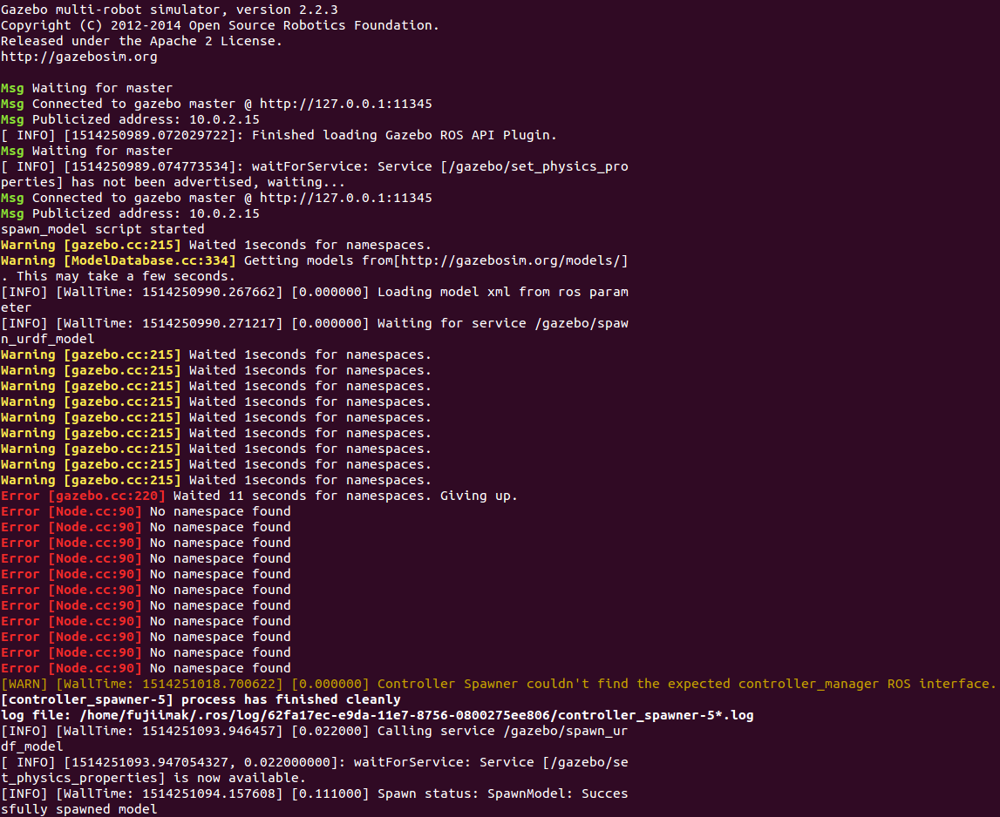

# ロボットシミュレータを使う

シミュレータ上のロボットを動かしてみます．<br>
本チュートリアルでは下記のロボットのシミュレータの利用方法を紹介します．

- NEXTAGE OPEN
- Baxter Research Robot
- MINAS TRA1


## シミュレータの種類

本チュートリアルで扱うシミュレータには次のような種類があります．

- ROS のシミュレータ
  - NEXTAGE OPEN / Baxter Research Robot / MINAS
    - MoveIt! シミュレータ : 運動学のみの動作計画シミュレータ
    - Gazebo シミュレータ : 動力学を含む環境・物理シミュレータ
- hrpsys(RTM) シミュレータ
  - NEXTAGE OPEN のみ
    - 動力学を含む物理シミュレータ

本チュートリアルではどのシミュレータを使っても最終的には
動作計画ソフトウェアの MoveIt! を起動してその動作計画機能を利用します．


## ソフトウェアのインストール

次のソフトウェアのインストールをします．

- ROS とチュートリアルパッケージ
- ロボットソフトウェア
  - NEXTAGE OPEN ソフトウェア
  - Baxter ソフトウェア
  - MINAS TRA1 ソフトウェア

ロボットソフトウェアは全てインストールしても，どれか1つでも大丈夫です．<br>
また，システム構成は次のとおりです．

- Ubuntu 14.04
- ROS Indigo


### ROS のインストール

ターミナルから次のコマンドを実行して
[ROS ソフトウェアをインストール](http://wiki.ros.org/indigo/Installation/Ubuntu)
します．
既に ROS がインストールされていれば，次のチュートリアルパッケージのインストールに進んでください．

```
$ sudo sh -c 'echo "deb http://packages.ros.org/ros/ubuntu trusty main" > /etc/apt/sources.list.d/ros-latest.list'
$ sudo apt-key adv --keyserver hkp://ha.pool.sks-keyservers.net --recv-key0xB01FA116
$ sudo apt-get update
$ sudo apt-get install ros-indigo-desktop-full
```

### チュートリアルパッケージのインストール

ターミナルから次のコマンドを実行して
チュートリアルパッケージのソフトウェアをインストールします．

```
$ sudo apt-get install ros-indigo-tork-moveit-tutorial
```


### NEXTAGE OPEN ソフトウェアのインストール

ターミナルから次のコマンドを実行して
NEXTAGE OPEN のソフトウェアをインストールします．

```
$ sudo apt-get update && sudo apt-get install ros-indigo-rtmros-nextage ros-indigo-rtmros-hironx
```


### Baxter ソフトウェアのインストール

ターミナルから次のコマンドを実行して
Baxter Research Robot のソフトウェアをインストールします．

```
$ sudo apt-get update
$ sudo apt-get install git-core python-argparse python-wstool python-vcstools python-rosdep ros-indigo-control-msgs ros-indigo-joystick-drivers
$ sudo apt-get install ros-indigo-baxter-sdk ros-indigo-baxter-moveit-config
$ sudo apt-get install gazebo2 ros-indigo-qt-build ros-indigo-driver-common ros-indigo-gazebo-ros-control ros-indigo-gazebo-ros-pkgs ros-indigo-ros-control ros-indigo-control-toolbox ros-indigo-realtime-tools ros-indigo-ros-controllers ros-indigo-xacro python-wstool ros-indigo-tf-conversions ros-indigo-kdl-parser
$ sudo apt-get install ros-indigo-baxter-simulator
```

　インストール方法については以下の公式ページにも説明があるので参照ください．このページから該当部分をコピーペーストすると上記のコマンドを打たなくても良くなります．
 - [http://sdk.rethinkrobotics.com/wiki/Workstation_Setup](http://sdk.rethinkrobotics.com/wiki/Workstation_Setup)
 - [http://sdk.rethinkrobotics.com/wiki/Workstation_Setup](http://sdk.rethinkrobotics.com/wiki/Simulator_Installation) 

### MINAS TRA1 シミュレータのインストール

ターミナルから次のコマンドを実行して
MINAS TRA1 のソフトウェアをインストールします．

```
$ sudo apt-get update && sudo apt-get install ros-indigo-minas
```


### インストールの最後に

インストールの最後に setup.bash を読み込み，ROS の環境を設定します．

```
$ source /opt/ros/indigo/setup.bash
```

これは新しくターミナルを立ち上げて ROS を使用する前に毎回必要になります．
下記のように .bashrc ファイルに設定を加えて
ターミナル起動時に setup.bash を自動で実行し ROS 環境になるようにしておくと便利です．

```
$ echo "source /opt/ros/indigo/setup.bash" >> ~/.bashrc
```

- 注意: 上記コマンドの `>>` を `>` にしてしまうと元々あった .bashrc 内の設定が消えてしまうので気をつけてください．

.bashrc の設定ができていると以後のターミナルを起動するたびに行う
`source /opt/ros/indigo/setup.bash` は不要です．


## シミュレータと MoveIt! の起動

<a id="start-nextage-hrpsys-simulator"></a>
### <a href="#start-nextage-hrpsys-simulator">NEXTAGE OPEN - hrpsys シミュレータ</a>

#### hrpsys シミュレータ・MoveIt! などの起動

NEXTAGE OPEN の動力学シミュレータの一つである
NEXTAGE OPEN hrpsys(RTM) シミュレータを起動します．
ターミナルを開いて次のコマンドを実行してください．

```
$ source /opt/ros/indigo/setup.bash
$ rtmlaunch nextage_moveit_config nextage_demo.launch
```

コマンドを実行すると次の4つのウィンドウが開きます．

- ターミナル
- hrpsys シミュレータ (hrpsys viewer)
- MoveIt! / RViz
- Hironx Dashboard (Command Panel for Hironx / NEXTAGE Open)


これで MoveIt! の動作計画機能が利用できる状態になっています．

#### シミュレータの終了

シミュレータを終了するには全体を起動したターミナル上で
Ctrl-C を入力すると全体が終了します．

<a id="start-nextage-gazebo-simulator"></a>
### <a href="#start-nextage-gazebo-simulator">NEXTAGE OPEN - Gazebo シミュレータ</a>

NEXTAGE OPEN のもうひとつの動力学シミュレータは
ROS の動力学環境シミュレータ Gazebo 上で動きます．

ターミナルを2つ開きます．

#### Gazebo シミュレータの起動

1つ目のターミナルで次のコマンドを入力しして
NEXTAGE OPEN Gazebo シミュレータを起動します．

**ターミナル-1** : Gazebo シミュレータの起動
```
$ source /opt/ros/indigo/setup.bash
$ roslaunch nextage_gazebo nextage_world.launch
:
:
[go_initial-6] process has finished cleanly
log file: /home/robotuser/.ros/log/5d4ac8aa-baeb-11e7-af06-001c4284b313/go_initial-6*.log
:
```

Gazebo が起動して上記のターミナルの出力が得られたら Gazebo シミュレータ内の
NEXTAGE OPEN ロボットの準備が完了しています．


- 注意: 最初にgazeboを立ち上げる際にはモデルデータをダウンロードするために
  以下のようにWarningやErrorが表示され数秒から数分の時間がかかります場合が有ります．
  「[トラブルシューティング (Gazebo を起動してもロボットが表示されない)](moveit-tutorial_ja_trouble-shooting.md#gazebo-start-not-show-robot)」もご参照ください．



#### MoveIt! の起動

2つ目のターミナルで次のコマンドを入力して MoveIt! を起動します．

**ターミナル-2** : MoveIt! の起動
```
$ source /opt/ros/indigo/setup.bash
$ roslaunch nextage_moveit_config moveit_planning_execution.launch
```


これで MoveIt! の動作計画機能が利用できる状態になっています．

#### シミュレータの終了

シミュレータを終了するには各ターミナルで Ctrl-C を入力してください．


### Baxter Research Robot - Gazebo シミュレータ

#### Gazebo シミュレータの起動

ターミナルを3つ開きます．

**ターミナル-1** : Baxter シミュレータの起動
```
$ source /opt/ros/indigo/setup.bash
$ roslaunch baxter_gazebo baxter_world.launch  
```


しばらくすると次のようなメッセージが **ターミナル-1** に表示されます．

```
[ INFO] [1509004453.402952141, 10.130000000]: Simulator is loaded and started successfully
[ INFO] [1509004453.462744480, 10.140000000]: Robot is disabled
[ INFO] [1509004453.462870807, 10.140000000]: Gravity compensation was turned off
```

これで Gazebo シミュレータの準備は終了です．

#### ロボットの準備

次にロボットを MoveIt! から操作可能な状態にします．
2つ目のターミナル上で次のコマンドを実行してください．

**ターミナル-2** : ロボットの準備
```
$ source /opt/ros/indigo/setup.bash
$ rosrun baxter_tools enable_robot.py -e

[INFO] [WallTime: 1509004993.657452] [192.385000] Robot Enabled

$ rosrun baxter_tools tuck_arms.py -u

[INFO] [WallTime: 1509005020.475291] [0.000000] Untucking arms
[INFO] [WallTime: 1509005020.910480] [202.807000] Moving head to neutral position
[INFO] [WallTime: 1509005020.911446] [202.808000] Untucking: Arms already Untucked; Moving to neutral position.
[INFO] [WallTime: 1509005024.476011] [204.036000] Finished tuck

$ rosrun baxter_interface joint_trajectory_action_server.py

Initializing node...
Initializing joint trajectory action server...
Running. Ctrl-c to quit
```


これでロボットの準備は終了です．

#### MoveIt! の起動

3つ目のターミナルで次のコマンドを実行して MoveIt! を起動します．

**ターミナル-3** : MoveIt! の起動
```
$ source /opt/ros/indigo/setup.bash
$ roslaunch baxter_moveit_config baxter_grippers.launch
```


これで MoveIt! の動作計画機能が利用できる状態になっています．


#### シミュレータの終了

シミュレータでの作業が終わりましたら
全てのターミナルで Ctrl-C を入力することでシミュレータを終了します．


### MINAS TRA1 - MoveIt! シミュレータ

ターミナルを2つ起動します．

1つ目のターミナルでコントローラをシミュレーションモードで起動します．

**ターミナル-1**
```
$ source /opt/ros/indigo/setup.bash
$ roslaunch tra1_bringup tra1_bringup.launch simulation:=true
```

2つ目のターミナルで MoveIt! を起動します．

**ターミナル-2**
```
$ source /opt/ros/indigo/setup.bash
$ roslaunch tra1_bringup tra1_moveit.launch
```


シミュレータを終了するには各ターミナルで Ctrl-C を入力してください．


### MoveIt! GUI での動作計画

MoveIt! の動作計画機能を GUI から利用してみます．

MoveIt! / RViz (GUI) 上に表示されているロボットのエンドエフェクタのところに
水色の球や赤緑青(RGB)の矢印マークが表示されています．
これは InteractiveMarker と呼ばれるもので
MoveIt! の GUI でのマニピュレータ操作を行うためのものです．

InteractiveMarker の球や矢印をマウスなどでドラッグ操作を行うと
オレンジ色のマニピュレータがそのドラッグ操作に追従して動きます．
これが目標姿勢となります．
そこで MotionPlanning 子ウィンドウ内の Planning タブ内の
` Plan and Execute` ボタンをクリックするとその目標姿勢に向かって
MoveIt! が動作計画を行い，シミュレータのロボットが動作します．

動作計画だけを行いたい場合は `Plan` ボタンをクリックします．


このように MoveIt! の GUI 上で
InteractiveMarker を動かして目標値を設定し，動作計画を行い実行する
という操作は基本的にどのロボットでも共通です．


<!-- EOF -->
