# ロボットシミュレータを使う

シミュレータ上のロボットを動かしてみます．  
本チュートリアルでは下記のロボットのシミュレータの利用方法を紹介します．

<$ifeq <$ROS_DISTRO>|indigo>

- NEXTAGE OPEN : 人型双腕ロボット
- Baxter Research Robot : 人型双腕ロボット
- MINAS TRA1 : 単腕マニピュレータ

<$endif>

<$ifeq <$ROS_DISTRO>|kinetic>

- NEXTAGE OPEN : 人型双腕ロボット
- MINAS TRA1 : 単腕マニピュレータ
- KHI duaro : スカラ型双腕ロボット
- Baxter Research Robot : 人型双腕ロボット（「ワークスペースの作成」の章にて）

<$endif>
<$ifeq <$ROS_DISTRO>|melodic>
- myCobot : 教育用単腕マニピュレータ
<$endif>

<$ifeq <$ROS_DISTRO>|melodic>

- NEXTAGE OPEN : 人型双腕ロボット
- MINAS TRA1 : 単腕マニピュレータ（「ソースインストール」の章にて）
- KHI duaro : スカラ型双腕ロボット（「ソースインストール」の章にて）
- Baxter Research Robot : 人型双腕ロボット（「ワークスペースの作成」の章にて）

<$endif>


## シミュレータの種類

本チュートリアルで扱うシミュレータには次のような種類があります．

<$ifeq <$ROS_DISTRO>|indigo>

- ROS のシミュレータ
  - NEXTAGE OPEN / Baxter Research Robot / MINAS TRA1
    - MoveIt! シミュレータ : 運動学のみの動作計画シミュレータ
    - Gazebo シミュレータ : 動力学を含む環境・物理シミュレータ
- hrpsys(RTM) シミュレータ
  - NEXTAGE OPEN のみ
    - 動力学を含む物理シミュレータ

<$endif>

<$ifneq <$ROS_DISTRO>|indigo>

- ROS のシミュレータ
  - NEXTAGE OPEN / Baxter Research Robot / MINAS TRA1 / KHI duaro
    - MoveIt! シミュレータ : 運動学のみの動作計画シミュレータ
    - Gazebo シミュレータ : 動力学を含む環境・物理シミュレータ
- hrpsys(RTM) シミュレータ
  - NEXTAGE OPEN のみ
    - 動力学を含む物理シミュレータ

<$endif>

本チュートリアルではどのシミュレータを使っても最終的には
動作計画ソフトウェアの MoveIt! を起動してその動作計画機能を利用します．

また，本チュートリアルの構成として，
NEXTAGE OPEN の Gazebo シミュレータと MoveIt! の組み合わせを基本として
各ロボットへの応用を展開する形を採っています．


## ソフトウェアのインストール

ソフトウェアのインストールでは主に次のインストール項目があります．

- ROS のインストール
- ロボットシミュレータなどのインストール

次のソフトウェアのインストールをします．
各ロボットソフトウェアは全てインストールしても，どれか1つでも大丈夫ですが，
本チュートリアルは NEXTAGE OPEN を中心的な例として記述していますので
少なくとも NEXTAGE OPEN ソフトウェアのインストールをお願いします．

NEXTAGE OPEN に加えて他のロボットのソフトウェアもインストールすると
他のロボットへのプログラム応用方法についての理解が進みます．

<$ifeq <$ROS_DISTRO>|indigo>

- ROS とチュートリアルパッケージ
- ロボットソフトウェア
  - NEXTAGE OPEN ソフトウェア
  - Baxter ソフトウェア
  - MINAS TRA1 ソフトウェア

<$endif>

<$ifneq <$ROS_DISTRO>|indigo>

- ROS とチュートリアルパッケージ
- ロボットソフトウェア
  - NEXTAGE OPEN ソフトウェア
  - MINAS TRA1 ソフトウェア
  - KHI duaro ソフトウェア

<$endif>

また，システム構成は次のとおりです．

<$ifeq <$ROS_DISTRO>|indigo>

- Ubuntu 14.04
- ROS Indigo

<$endif>

<$ifeq <$ROS_DISTRO>|kinetic>

- Ubuntu 16.04
- ROS Kinetic

<$endif>

<$ifeq <$ROS_DISTRO>|melodic>

- Ubuntu 18.04
- ROS Melodic

<$endif>

> ROS は Ubuntu の各バージョンに対応したものがあります．
> それぞれに対応した Ubuntu と ROS の組み合わせで利用する必要があります．
> 
>  Ubuntu バージョン | ROS バージョン | サポート終了
>  --- | --- | ---
>  20.04 (Focal)  | Noetic Ninjemys | 2025年5月
>  18.04 (Bionic) | Melodic Morenia| 2023年5月
>  16.04 (Xenial) | Kinetic Kame | 2021年4月
>  14.04 (Trusty) | Indigo Igloo | 2019年4月
> 
> 詳しくは下記の ROS Wiki で確認してください．
> 
> - ROS Wiki - Distributions
>     - http://wiki.ros.org/Distributions


### ROS のインストール

ターミナルから次のコマンドを実行して
[ROS ソフトウェアをインストール](http://wiki.ros.org/<$ROS_DISTRO>/Installation/Ubuntu)
します．
既に ROS がインストールされていれば，次のチュートリアルパッケージのインストールに進んでください．

<$ifeq <$ROS_DISTRO>|indigo>

```
$ sudo sh -c 'echo "deb http://packages.ros.org/ros/ubuntu $(lsb_release -sc) main" > /etc/apt/sources.list.d/ros-latest.list'
$ sudo apt-key adv --keyserver 'hkp://keyserver.ubuntu.com:80' --recv-key C1CF6E31E6BADE8868B172B4F42ED6FBAB17C654
$ sudo apt-get update
$ sudo apt-get install ros-indigo-desktop-full
```

<$endif>

<$ifneq <$ROS_DISTRO>|indigo>

```
$ sudo sh -c 'echo "deb http://packages.ros.org/ros/ubuntu $(lsb_release -sc) main" > /etc/apt/sources.list.d/ros-latest.list'
$ sudo apt-key adv --keyserver 'hkp://keyserver.ubuntu.com:80' --recv-key C1CF6E31E6BADE8868B172B4F42ED6FBAB17C654
sudo apt-get update
sudo apt-get install ros-<$ROS_DISTRO>-desktop-full
```

<$endif>

rosdep の初期化を行います．

```
$ sudo rosdep init
$ rosdep update
```

rosinstall をインストールします．

```
sudo apt-get install python-rosinstall
```

- 参考 :
  - [Ubuntu install of ROS <$ROS_DISTRO>](http://wiki.ros.org/<$ROS_DISTRO>/Installation/Ubuntu)
  - [ROS <$ROS_DISTRO> の Ubuntu へのインストール](http://wiki.ros.org/ja/<$ROS_DISTRO>/Installation/Ubuntu)


### チュートリアルパッケージのインストール

ターミナルから次のコマンドを実行して
チュートリアルパッケージのソフトウェアをインストールします．

```
$ sudo apt-get install ros-<$ROS_DISTRO>-tork-moveit-tutorial
```


### NEXTAGE OPEN ソフトウェアのインストール

ターミナルから次のコマンドを実行して
NEXTAGE OPEN のソフトウェアをインストールします．

```
$ sudo apt-get update && sudo apt-get install ros-<$ROS_DISTRO>-rtmros-nextage ros-<$ROS_DISTRO>-rtmros-hironx
```


<$ifeq <$ROS_DISTRO>|indigo>

### Baxter ソフトウェアのインストール

ターミナルから次のコマンドを実行して
Baxter Research Robot のソフトウェアをインストールします．

```
$ sudo apt-get update
$ sudo apt-get install git-core python-argparse python-wstool python-vcstools python-rosdep ros-<$ROS_DISTRO>-control-msgs ros-<$ROS_DISTRO>-joystick-drivers
$ sudo apt-get install ros-<$ROS_DISTRO>-baxter-sdk ros-<$ROS_DISTRO>-baxter-moveit-config
$ sudo apt-get install gazebo2 ros-<$ROS_DISTRO>-qt-build ros-<$ROS_DISTRO>-driver-common ros-<$ROS_DISTRO>-gazebo-ros-control ros-<$ROS_DISTRO>-gazebo-ros-pkgs ros-<$ROS_DISTRO>-ros-control ros-<$ROS_DISTRO>-control-toolbox ros-<$ROS_DISTRO>-realtime-tools ros-<$ROS_DISTRO>-ros-controllers ros-<$ROS_DISTRO>-xacro python-wstool ros-<$ROS_DISTRO>-tf-conversions ros-<$ROS_DISTRO>-kdl-parser
$ sudo apt-get install ros-<$ROS_DISTRO>-baxter-simulator
```

インストール方法については以下の公式ページにも説明があるので参照ください．

 - [http://sdk.rethinkrobotics.com/wiki/Workstation_Setup](http://sdk.rethinkrobotics.com/wiki/Workstation_Setup)
 - [http://sdk.rethinkrobotics.com/wiki/Simulator_Installation](http://sdk.rethinkrobotics.com/wiki/Simulator_Installation)

<$endif>


### MINAS TRA1 ソフトウェアのインストール

ターミナルから次のコマンドを実行して
MINAS TRA1 のソフトウェアをインストールします．

```
$ sudo apt-get update && sudo apt-get install ros-<$ROS_DISTRO>-minas
```


<$ifneq <$ROS_DISTRO>|indigo>

### KHI duaro ソフトウェアのインストール

ターミナルから次のコマンドを実行して
KHI duaro のソフトウェアをインストールします．

```
$ sudo apt-get update && sudo apt-get install ros-<$ROS_DISTRO>-khi-duaro-gazebo ros-<$ROS_DISTRO>-khi-duaro-description ros-<$ROS_DISTRO>-khi-duaro-ikfast-plugin ros-<$ROS_DISTRO>-khi-duaro-moveit-config
```

<$endif>

<$ifeq <$ROS_DISTRO>|melodic>

### myCobot ソフトウェアのインストール

myCobotのソフトウェアのインストールにはワークスペースの作成が必要です．

- catkin の workspace を作る
  - http://wiki.ros.org/ja/catkin/Tutorials/create_a_workspace

`catkin_ws` という名前のワークスペースを作成する手順は次のとおりです．

```
$ mkdir -p ~/catkin_ws/src
$ cd ~/catkin_ws/src
$ catkin_init_workspace
$ cd ~/catkin_ws/
$ catkin_make
$ source devel/setup.bash
```

次に，myCobot のソースコードの取得とビルドを行います．

```
$ cd ~/catkin_ws/src
$ git clone https://github.com/elephantrobotics/mycobot_ros
$ cd ~/catkin_ws
$ catkin_make
$ source devel/setup.bash
```

<$endif>


### インストールの最後に

インストールの最後に setup.bash を読み込み，ROS の環境を設定します．

```
$ source /opt/ros/<$ROS_DISTRO>/setup.bash
```

これは新しくターミナルを立ち上げて ROS を使用する前に毎回必要になります．
下記のように .bashrc ファイルに設定を加えて
ターミナル起動時に setup.bash を自動で実行し ROS 環境になるようにしておくと便利です．

```
$ echo "source /opt/ros/<$ROS_DISTRO>/setup.bash" >> ~/.bashrc
```

- **注意**: 上記コマンドの `>>` を `>` にしてしまうと元々あった .bashrc 内の設定が消えてしまうので気をつけてください．

.bashrc の設定ができていると以後のターミナルを起動するたびに行う
`source /opt/ros/<$ROS_DISTRO>/setup.bash` は不要です．


<$ifeq <$ROS_DISTRO>|melodic>

## ソースインストール

aptでインストールできるようにバイナリ／リリースされていないロボットパッケージはワークスペース経由でインストールすることができます．標準では推奨されていな方法ですので十分に注意して実行してください．

まず，`/tmp/catkin_ws` という名前のワークスペースを作成する手順は次のとおりです．

```
$ source /opt/ros/<$ROS_DISTRO>/setup.bash
$ mkdir -p /tmp/catkin_ws/src
$ cd /tmp/catkin_ws/src
$ catkin_init_workspace
```

### MINAS TRA1 ソフトウェアの取得とビルド

次の手順で MINAS TRA1 のクローンと
それに必要なソフトウェアパッケージの取得，ビルドを行います．

```
$ cd /tmp/catkin_ws/src
$ git clone https://github.com/tork-a/minas.git
$ rosdep install --from-path . --ignore-src -y
$ cd /tmp/catkin_ws
$ catkin_make
```

### KHI duaro ソフトウェアの取得とビルド

次の手順で KHI Duaro のクローンと
それに必要なソフトウェアパッケージの取得，ビルドを行います．

```
$ cd /tmp/catkin_ws/src
$ git clone https://github.com/Kawasaki-Robotics/khi_robot.git
$ rosdep install --from-path . --ignore-src -y
$ cd /tmp/catkin_ws
$ catkin_make
```

### ワークスペースでビルドしたソフトウェアのインストール

ここまでの手順がエラー無く進んでいることを再度確認したら
次の手順によりワークスペースでビルドしたパッケージを
`/opt/ros/<$ROS_DISTRO>/`へとインストールします．

繰り返しになりますが標準では推奨されない方法ですので
もしここまでの手順でエラーが出ていれば作業を中止してください．

```
$ cd /tmp/catkin_ws
$ sudo su
$ source /opt/ros/<$ROS_DISTRO>/setup.bash
$ catkin_make_isolated --install --install-space /opt/ros/<$ROS_DISTRO> -DCMAKE_BUILD_TYPE=Release
```

<$endif>

## シミュレータと MoveIt! の起動

<a id="start-nextage-hrpsys-simulator"></a>
### <a href="#start-nextage-hrpsys-simulator">NEXTAGE OPEN - hrpsys シミュレータ</a>

#### hrpsys シミュレータ・MoveIt! などの起動

NEXTAGE OPEN の動力学シミュレータの一つである
NEXTAGE OPEN hrpsys(RTM) シミュレータを起動します．
ターミナルを開いて次のコマンドを実行してください．

```
$ source /opt/ros/<$ROS_DISTRO>/setup.bash
$ rtmlaunch nextage_moveit_config nextage_demo.launch
```

コマンドを実行すると次の4つのウィンドウが開きます．

- ターミナル
- hrpsys シミュレータ (hrpsys viewer)
- MoveIt! / RViz
- Hironx Dashboard (Command Panel for Hironx / NEXTAGE Open)

<$ifeq <$ROS_DISTRO>|indigo>

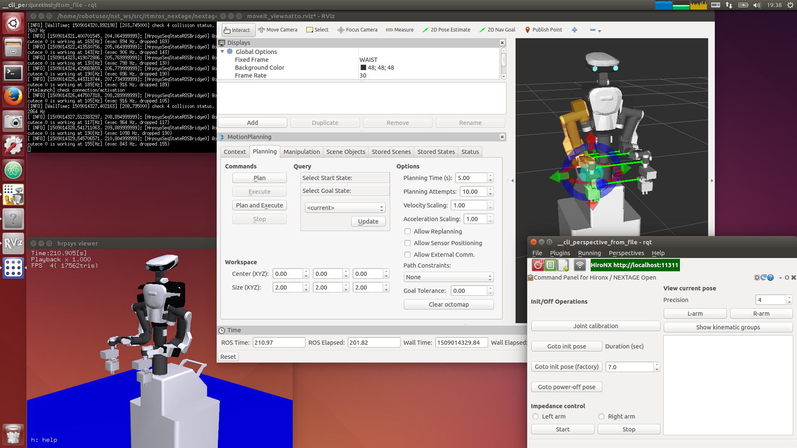

<$endif>

<$ifneq <$ROS_DISTRO>|indigo>

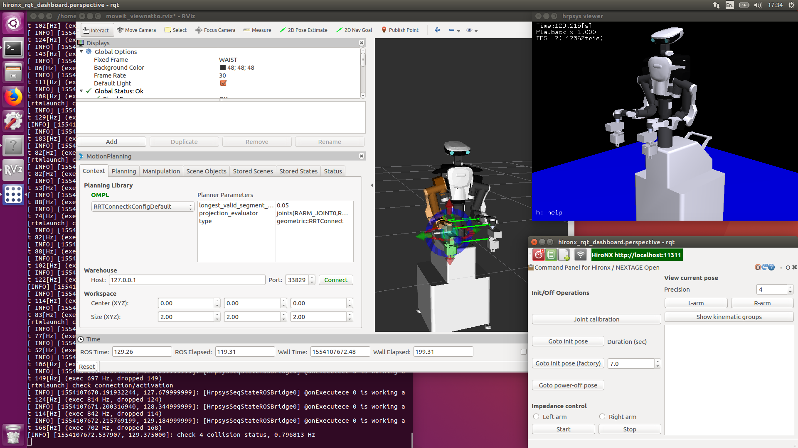

<$endif>

これで MoveIt! の動作計画機能が利用できる状態になっています．

#### シミュレータの終了

シミュレータを終了するには全体を起動したターミナル上で
Ctrl-C を入力すると全体が終了します．

<a id="start-nextage-gazebo-simulator"></a>
### <a href="#start-nextage-gazebo-simulator">NEXTAGE OPEN - Gazebo シミュレータ</a>

NEXTAGE OPEN のもうひとつの動力学シミュレータは
ROS の動力学環境シミュレータ Gazebo 上で動きます．

ターミナルを2つ開きます．

#### Gazebo シミュレータの起動

1つ目のターミナルで次のコマンドを入力しして
NEXTAGE OPEN Gazebo シミュレータを起動します．

**ターミナル-1** : Gazebo シミュレータの起動
```
$ source /opt/ros/<$ROS_DISTRO>/setup.bash
$ roslaunch nextage_gazebo nextage_world.launch
:
:
[go_initial-6] process has finished cleanly
log file: /home/robotuser/.ros/log/5d4ac8aa-baeb-11e7-af06-001c4284b313/go_initial-6*.log
:
```

Gazebo が起動して上記のターミナルの出力が得られたら Gazebo シミュレータ内の
NEXTAGE OPEN ロボットの準備が完了しています．

<$ifeq <$ROS_DISTRO>|indigo>

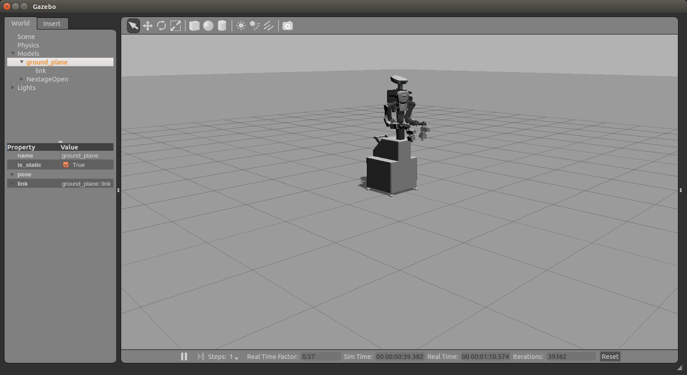

<$endif>

<$ifneq <$ROS_DISTRO>|indigo>

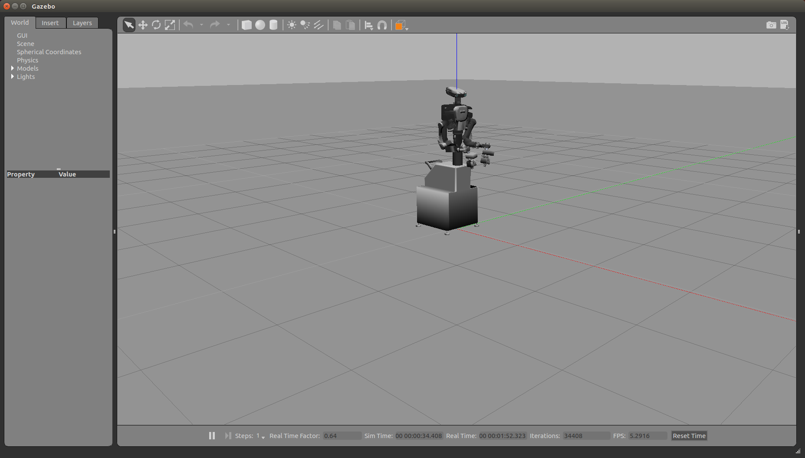

<$endif>

- 注意: 最初にgazeboを立ち上げる際にはモデルデータをダウンロードするために
  以下のようにWarningやErrorが表示され数秒から数分の時間がかかる場合が有ります．
  「[トラブルシューティング (Gazebo を起動してもロボットが表示されない)](moveit-tutorial_ja_trouble-shooting.md#gazebo-start-not-show-robot)」もご参照ください．

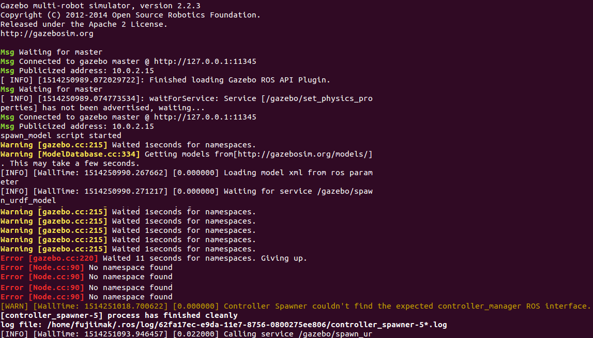

#### MoveIt! の起動

2つ目のターミナルで次のコマンドを入力して MoveIt! を起動します．

**ターミナル-2** : MoveIt! の起動
```
$ source /opt/ros/<$ROS_DISTRO>/setup.bash
$ roslaunch nextage_moveit_config moveit_planning_execution.launch
```
<$ifeq <$ROS_DISTRO>|indigo>

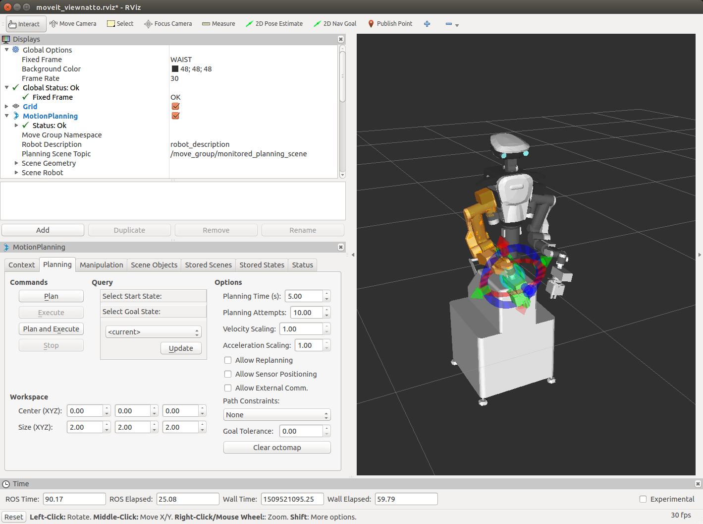

<$endif>

<$ifneq <$ROS_DISTRO>|indigo>

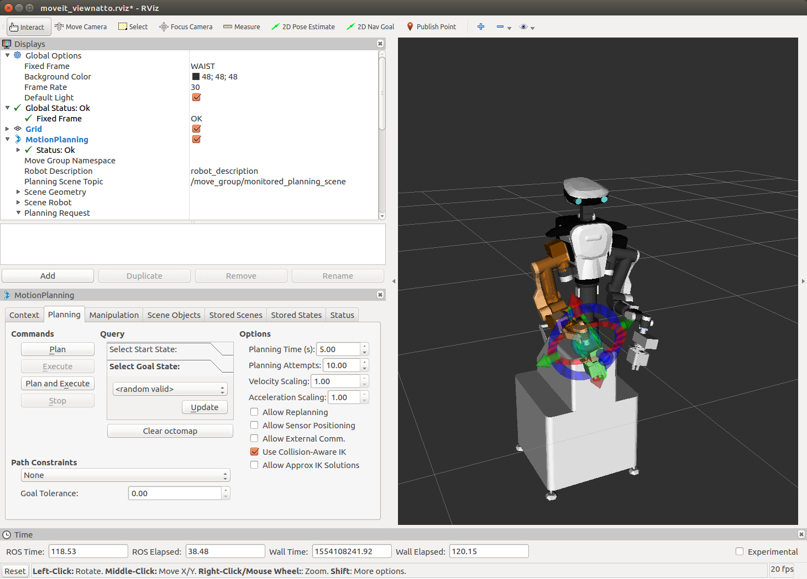

<$endif>

これで MoveIt! の動作計画機能が利用できる状態になっています．

#### シミュレータの終了

シミュレータを終了するには各ターミナルで Ctrl-C を入力してください．


<$ifeq <$ROS_DISTRO>|indigo>

### Baxter Research Robot - Gazebo シミュレータ

#### Gazebo シミュレータの起動

ターミナルを3つ開きます．

**ターミナル-1** : Baxter シミュレータの起動
```
$ source /opt/ros/<$ROS_DISTRO>/setup.bash
$ roslaunch baxter_gazebo baxter_world.launch  
```

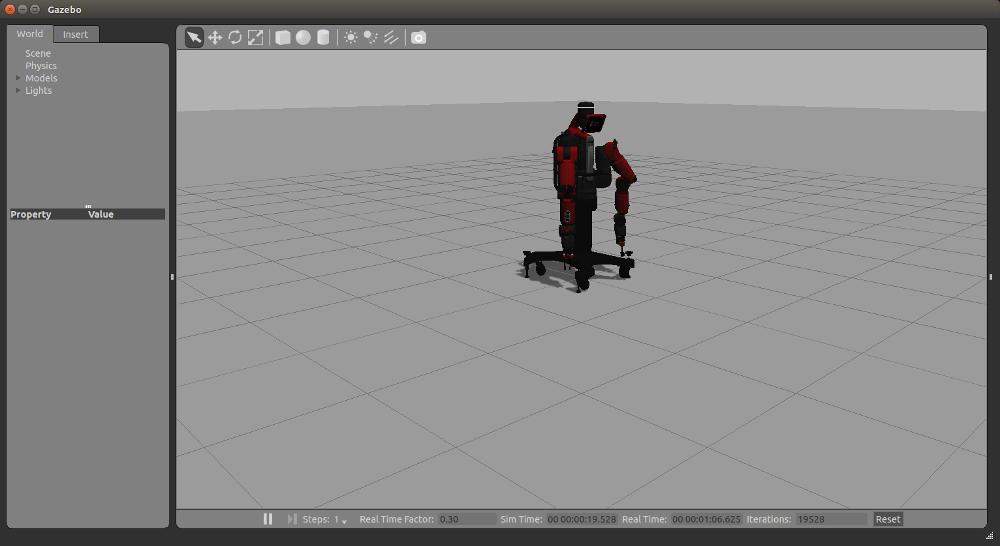

しばらくすると次のようなメッセージが **ターミナル-1** に表示されます．

```
[ INFO] [1509004453.402952141, 10.130000000]: Simulator is loaded and started successfully
[ INFO] [1509004453.462744480, 10.140000000]: Robot is disabled
[ INFO] [1509004453.462870807, 10.140000000]: Gravity compensation was turned off
```

これで Gazebo シミュレータの準備は終了です．

#### ロボットの準備

次にロボットを MoveIt! から操作可能な状態にします．
2つ目のターミナル上で次のコマンドを実行してください．

**ターミナル-2** : ロボットの準備
```
$ source /opt/ros/<$ROS_DISTRO>/setup.bash
$ rosrun baxter_tools enable_robot.py -e

[INFO] [WallTime: 1509004993.657452] [192.385000] Robot Enabled

$ rosrun baxter_tools tuck_arms.py -u

[INFO] [WallTime: 1509005020.475291] [0.000000] Untucking arms
[INFO] [WallTime: 1509005020.910480] [202.807000] Moving head to neutral position
[INFO] [WallTime: 1509005020.911446] [202.808000] Untucking: Arms already Untucked; Moving to neutral position.
[INFO] [WallTime: 1509005024.476011] [204.036000] Finished tuck

$ rosrun baxter_interface joint_trajectory_action_server.py

Initializing node...
Initializing joint trajectory action server...
Running. Ctrl-c to quit
```

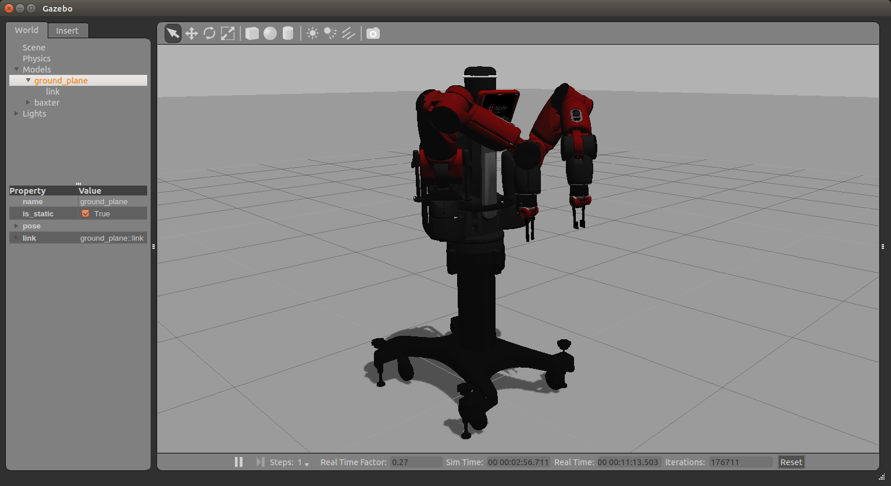

これでロボットの準備は終了です．

#### MoveIt! の起動

3つ目のターミナルで次のコマンドを実行して MoveIt! を起動します．

**ターミナル-3** : MoveIt! の起動
```
$ source /opt/ros/<$ROS_DISTRO>/setup.bash
$ roslaunch baxter_moveit_config baxter_grippers.launch
```


これで MoveIt! の動作計画機能が利用できる状態になっています．


#### シミュレータの終了

シミュレータでの作業が終わりましたら
全てのターミナルで Ctrl-C を入力することでシミュレータを終了します．

<$endif>


### MINAS TRA1 - MoveIt! シミュレータ

ターミナルを2つ起動します．

1つ目のターミナルでコントローラをシミュレーションモードで起動します．

**ターミナル-1**
```
$ source /opt/ros/<$ROS_DISTRO>/setup.bash
$ roslaunch tra1_bringup tra1_bringup.launch simulation:=true
```

2つ目のターミナルで MoveIt! を起動します．

**ターミナル-2**
```
$ source /opt/ros/<$ROS_DISTRO>/setup.bash
$ roslaunch tra1_bringup tra1_moveit.launch
```

<$ifeq <$ROS_DISTRO>|indigo>

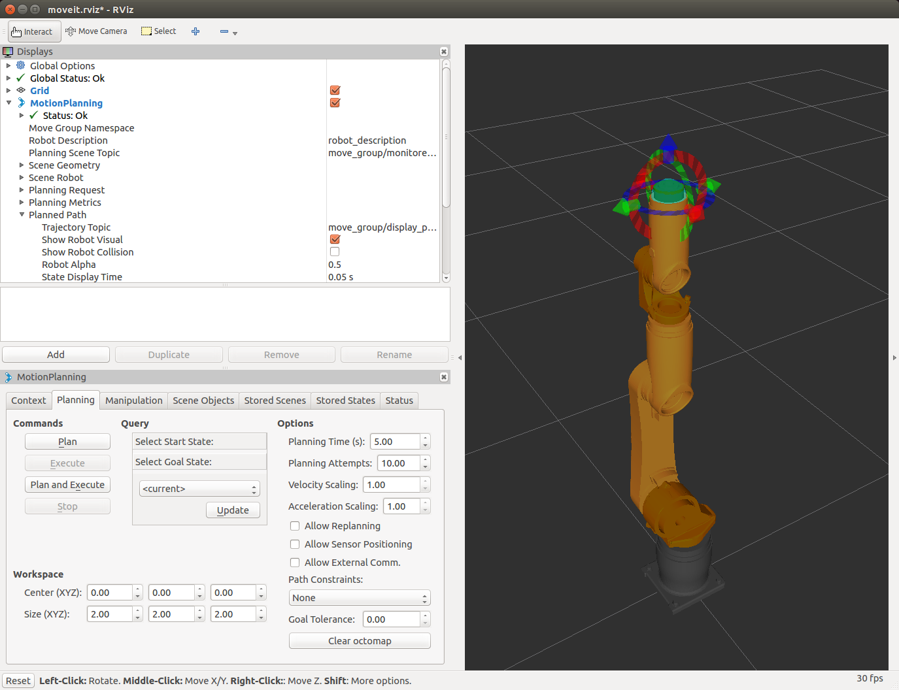

<$endif>

<$ifneq <$ROS_DISTRO>|indigo>

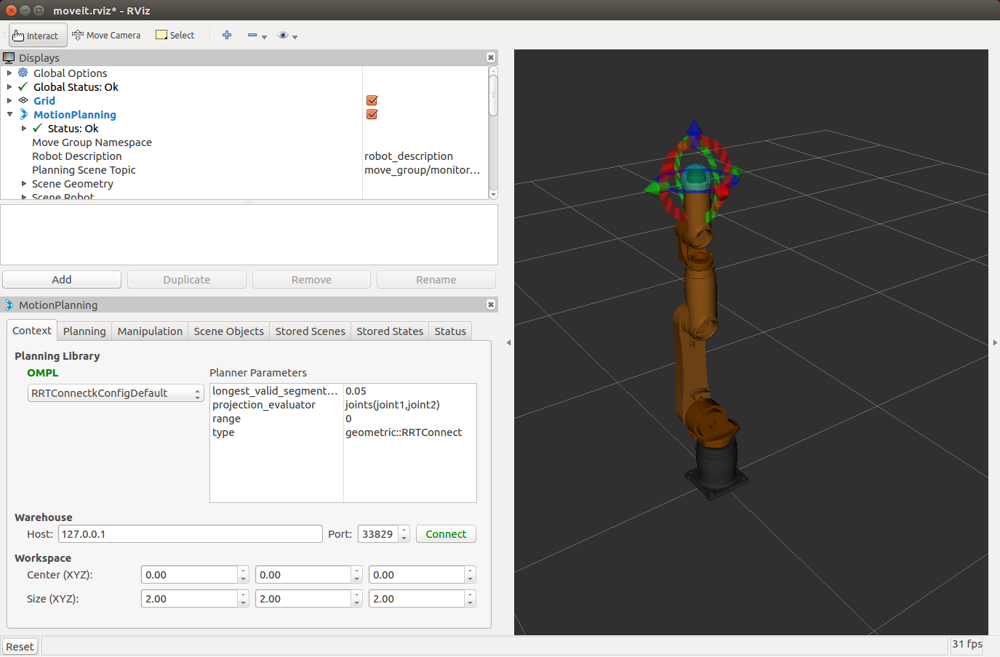

<$endif>

シミュレータを終了するには各ターミナルで Ctrl-C を入力してください．


<$ifneq <$ROS_DISTRO>|indigo>

### KHI duaro - Gazebo シミュレータ

#### Gazebo シミュレータの起動

ターミナルを2つ開きます．

**ターミナル-1** : KHI duaro Gazebo シミュレータの起動
```
$ source /opt/ros/<$ROS_DISTRO>/setup.bash
$ roslaunch khi_duaro_gazebo duaro_world.launch  
```

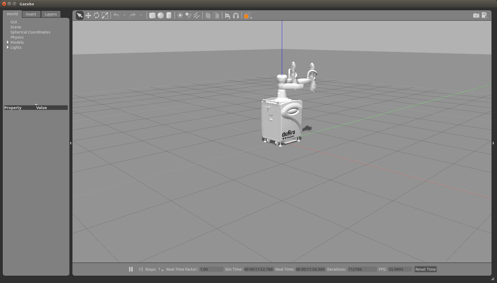

しばらくすると次のようなメッセージが **ターミナル-1** に表示されます．

```
[INFO] [1557303124.764122, 0.426000]: Started controllers: joint_state_controller, duaro_lower_arm_controller, duaro_upper_arm_controller
[go_initial-8] process has finished cleanly
log file: /home/robotuser/.ros/log/f5391a42-7168-11e9-931c-1c1bb5f26084/go_initial-8*.log
```

これで Gazebo シミュレータの準備は終了です．


#### MoveIt! の起動

2つ目のターミナルで次のコマンドを実行して MoveIt! を起動します．

**ターミナル-2** : MoveIt! の起動
```
$ source /opt/ros/<$ROS_DISTRO>/setup.bash
$ roslaunch khi_duaro_moveit_config moveit_planning_execution.launch
```

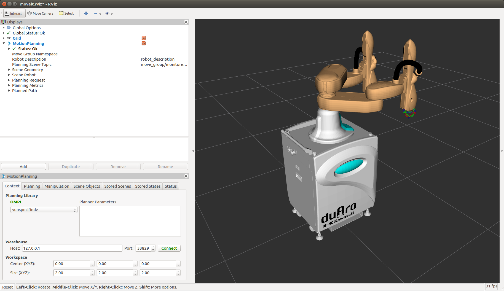

これで MoveIt! の動作計画機能が利用できる状態になっています．


#### シミュレータの終了

シミュレータでの作業が終わりましたら
全てのターミナルで Ctrl-C を入力することでシミュレータを終了します．

<$endif>

<$ifeq <$ROS_DISTRO>|melodic>

### myCobot - シミュレータ

#### MoveIt! の起動

ーミナルで次のコマンドを実行して MoveIt! を起動します．

**ターミナル-2** : MoveIt! の起動
```
$ source ~/catkin_ws/devel/setup.bash
$ roslaunch roslaunch mycobot_320_moveit demo.launch
```

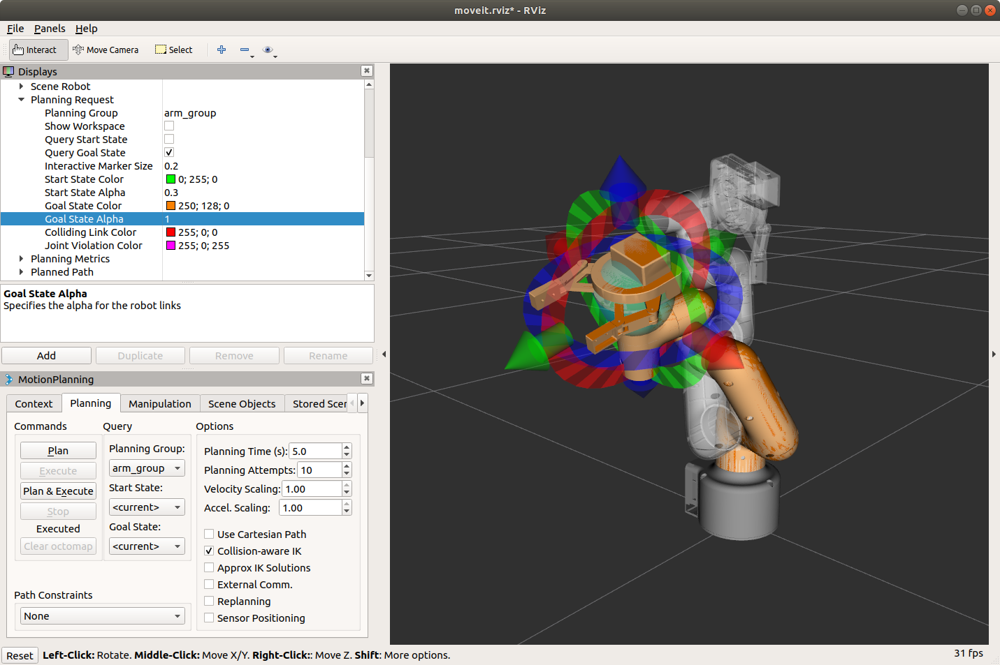

これで MoveIt! の動作計画機能が利用できる状態になっています．


#### シミュレータの終了

シミュレータでの作業が終わりましたら
全てのターミナルで Ctrl-C を入力することでシミュレータを終了します．

<$endif>


### MoveIt! GUI での動作計画

MoveIt! の動作計画機能を GUI から利用してみます．

MoveIt! / RViz (GUI) 上に表示されているロボットのエンドエフェクタのところに
水色の球や赤緑青(RGB)の矢印マークが表示されています．
これは InteractiveMarker と呼ばれるもので
MoveIt! の GUI でのマニピュレータ操作を行うためのものです．

> - エンドエフェクタ: End Effector (EEF)
>   - マニピュレータ先端に着けるハンド・グリッパ・工具などの機器

InteractiveMarker の球や矢印をマウスなどでドラッグ操作を行うと
オレンジ色のマニピュレータがそのドラッグ操作に追従して動きます．
これが目標姿勢となります．
そこで MotionPlanning 子ウィンドウ内の Planning タブ内の
` Plan and Execute` ボタンをクリックするとその目標姿勢に向かって
MoveIt! が動作計画を行い，シミュレータのロボットが動作します．

動作計画だけを行いたい場合は `Plan` ボタンをクリックします．

<$ifeq <$ROS_DISTRO>|indigo>

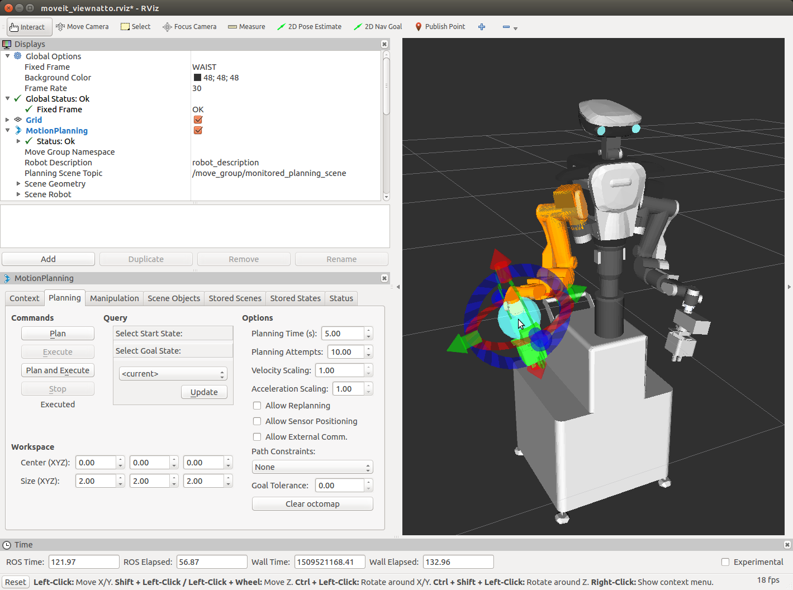

<$endif>

<$ifneq <$ROS_DISTRO>|indigo>

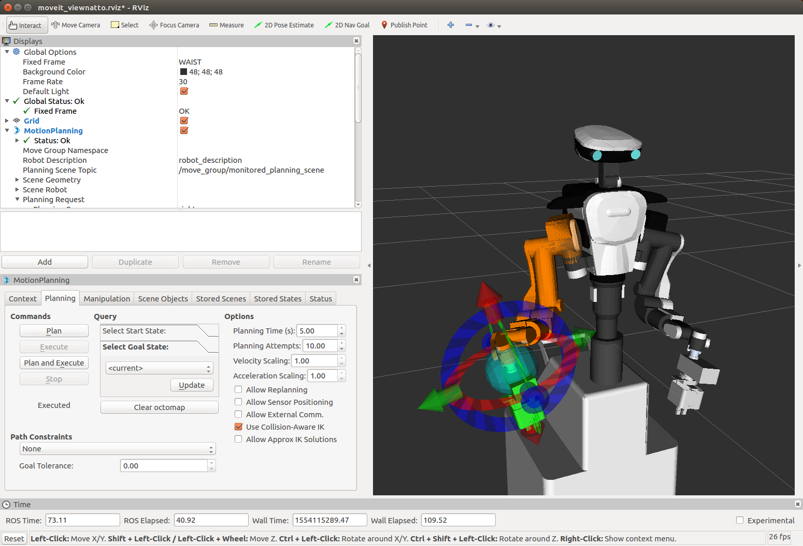

<$endif>

このように MoveIt! の GUI 上で
InteractiveMarker を動かして目標値を設定し，動作計画を行い実行する
という操作は基本的にどのロボットでも共通です．


<!-- EOF -->
